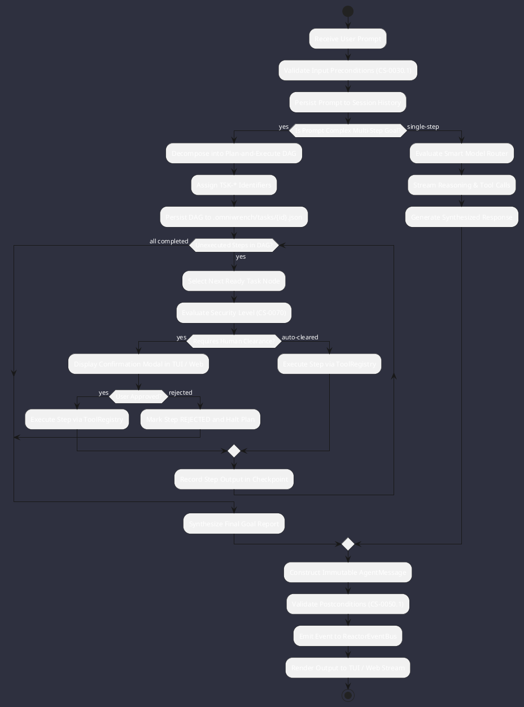
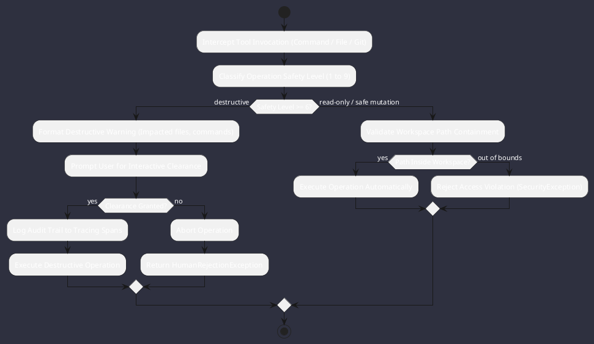
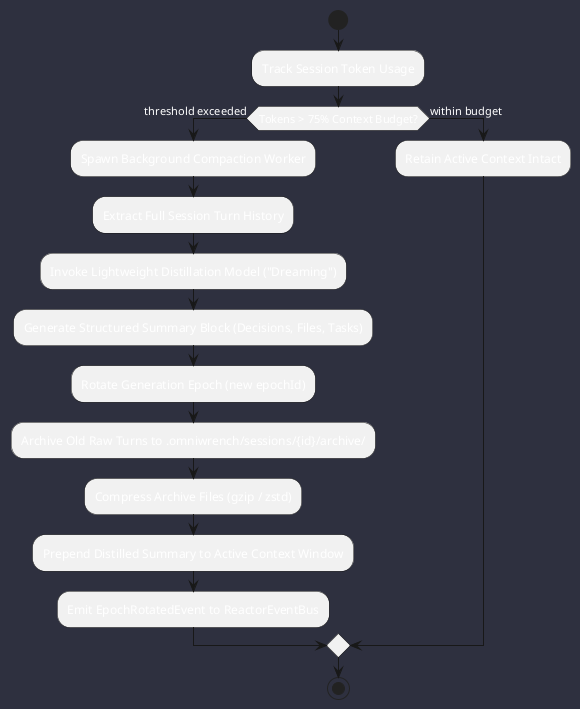

# Reasoning & Execution Activities

Comprehensive activity diagrams modeling the internal workflows of Omniwrench's reasoning loop, command safety evaluations, and generational context dreaming.

## 1. Hybrid Reasoning Cycle (Single-Step vs Plan-and-Execute DAG)

## 2. Command Safety Clearance Protocol (CS-0070)

## 3. Generational Context Dreaming (Compaction) Workflow

