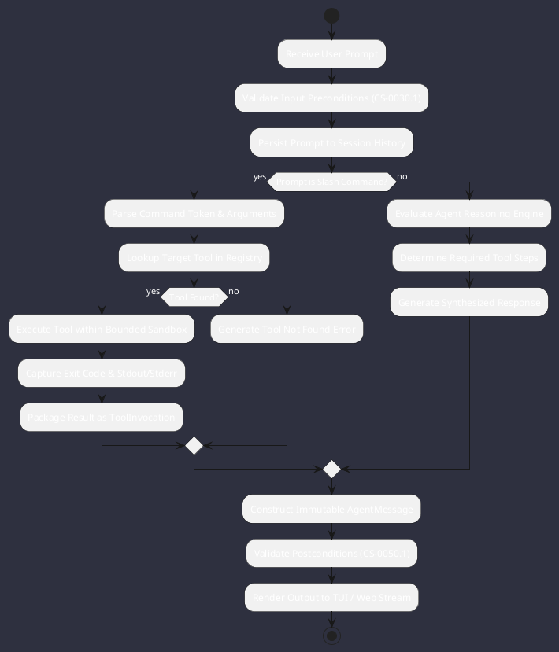

# Reasoning Activities

Activity diagrams detailing autonomous step execution and safety gate checks in Omniwrench.

```plantuml
@startuml
skinparam backgroundColor #2e303f
skinparam defaultFontColor #ffffff

start
:Receive User Prompt;
:Validate Input Preconditions (CS-0030.1);
:Persist Prompt to Session History;

if (Prompt is Slash Command?) then (yes)
  :Parse Command Token & Arguments;
  :Lookup Target Tool in Registry;
  if (Tool Found?) then (yes)
    :Execute Tool within Bounded Sandbox;
    :Capture Exit Code & Stdout/Stderr;
    :Package Result as ToolInvocation;
  else (no)
    :Generate Tool Not Found Error;
  endif
else (no)
  :Evaluate Agent Reasoning Engine;
  :Determine Required Tool Steps;
  :Generate Synthesized Response;
endif

:Construct Immutable AgentMessage;
:Validate Postconditions (CS-0050.1);
:Render Output to TUI / Web Stream;
stop
@enduml
```
