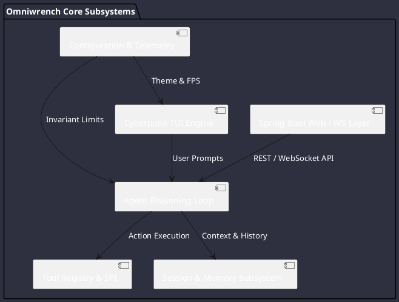

# Omniwrench Architecture Specifications

Omniwrench is engineered as a high-performance, dual-interface autonomous agent runtime.

## Architectural Sections

- [System Components](components.md): Deep-dive into subsystem boundaries and responsibilities.
- [Package Dependencies](dependencies.md): Maven module and Java package coupling matrix.
- [Execution Sequences](sequences.md): Interactive prompts, tool calls, and subagent delegation sequence diagrams.
- [Reasoning Activities](activities.md): Step-by-step reasoning cycle activity workflows.
- [Class Diagrams & Patterns](classes.md): State, Strategy, and Factory object-oriented patterns.
- [Interfaces & SPIs](interfaces.md): Extensible SPI definitions for tools, listeners, and storage.
- [File Formats & Schema](file_formats.md): JSON/YAML schemas for session serialization and task files.
- [Configuration Specifications](configuration.md): Runtime profiles and property parameters.
