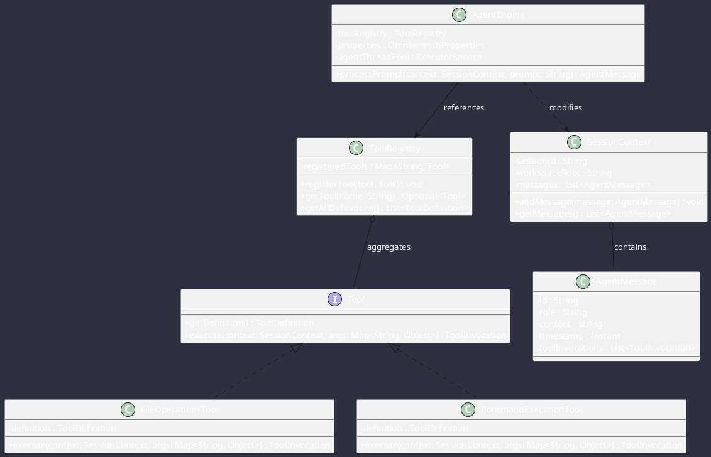

# Class Diagrams & Patterns

Omniwrench applies Object-Oriented patterns to manage lifecycle complexity in strict adherence to **CS-0030.6**.

## Pattern Applications
- **Strategy Pattern (`Tool`)**: Concrete execution strategies (`FileOperationsTool`, `CommandExecutionTool`) encapsulated behind a common interface.
- **Factory Pattern (`AgentMessage.of()`, `SessionContext.createDefault()`)**: Standardized, validated factory instantiation methods.
- **Immutability Contract**: Domain data carriers (`AgentMessage`, `ToolDefinition`, `ToolInvocation`) are strictly final with unmodifiable internal collections.
