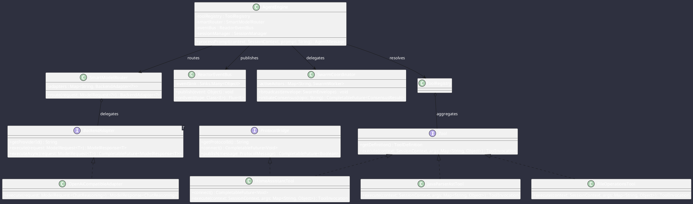

# Class Diagrams & Architectural Design Patterns

Omniwrench applies robust Object-Oriented and Functional patterns across its domain, engine, AI adapters, and tooling layers in strict adherence to **CS-0030.6**.

## Design Pattern Applications

- **Strategy Pattern (`Tool`, `BackendAdapter`)**: Concrete execution strategies (`FileOperationsTool`, `JavaParserAstTool`, `OpenAiCompatibleAdapter`) encapsulated behind typed SPI contracts.
- **Router Pattern (`SmartModelRouter`)**: Dynamic rule-based request routing optimizing between cloud API cost, latency, and reasoning capability.
- **Actor Pattern (`SwarmCoordinator`, `SwarmWorker`)**: Virtual-thread actor channels exchanging immutable envelopes (`SwarmEnvelope`) with isolated mailboxes and deadlock timeouts.
- **Reactive Observer Pattern (`ReactorEventBus`)**: Decoupled, non-blocking pub/sub message mesh backed by Project Reactor multicast Sinks.
- **Factory & Record Immutability**: All data transfer objects (`AgentMessage`, `ProtocolMessage`, `ModelRequest`, `ToolDefinition`) are implemented as immutable records with defensive copying.

