# System Components Architecture

Omniwrench segregates duties cleanly across its 6 Maven modules: presentation, core engine, multi-modal AI adapters, tools & protocols, web & telemetry, and application packaging.

```plantuml
@startuml
skinparam backgroundColor #2e303f
skinparam defaultFontColor #ffffff
skinparam componentStyle uml2

rectangle "Presentation Tier (omniwrench-tui & omniwrench-web)" {
  [OmniwrenchTuiDashboard] as TUI_DASH
  [TerminalRenderer] as TUI_REND
  [NeonDiffViewer] as DIFF_VIEW
  [ThemeEngine] as THEME_ENG
  [AgentController] as REST_CTRL
  [StatusController] as STAT_CTRL
  [WebSocketTelemetry] as WS_TEL
  [SpaWebHud] as SPA_HUD
}

rectangle "Core Engine Tier (omniwrench-core)" {
  [AgentEngine] as ENGINE
  [SessionManager] as SESS_MGR
  [ReactorEventBus] as EVENT_BUS
  [ToolRegistry] as TOOL_REG
  [SwarmCoordinator] as SWARM_COORD
  [ConsensusCoordinator] as CONS_COORD
  [TaskDAGScheduler] as DAG_SCHED
  [CompactionDreamingWorker] as DREAM_WRK
  [SecurityGuardrailsEngine] as GUARD_ENG
}

rectangle "AI & Retrieval Tier (omniwrench-ai)" {
  [SmartModelRouter] as SMART_ROUTER
  [OpenAiCompatibleAdapter] as OPENAI_ADAPT
  [LocalLlamaAdapter] as LLAMA_ADAPT
  [HybridRagEngine] as RAG_ENG
}

rectangle "Tools & Protocol Tier (omniwrench-tools)" {
  [FileOperationsTool] as FILE_TOOL
  [CommandExecutionTool] as CMD_TOOL
  [JavaParserAstTool] as AST_TOOL
  [GitOperationsTool] as GIT_TOOL
  [HomeAssistantTool] as HA_TOOL
  [McpClientManager] as MCP_CLIENT
  [McpServerHost] as MCP_HOST
}

TUI_DASH --> ENGINE : Dispatches Prompts
TUI_DASH --> DIFF_VIEW : Renders Diff
TUI_DASH --> THEME_ENG : Selects Palette
REST_CTRL --> ENGINE : REST Dialogue
SPA_HUD --> WS_TEL : Telemetry Stream

ENGINE --> SMART_ROUTER : Requests Inference
SMART_ROUTER --> OPENAI_ADAPT : Routes Requests
SMART_ROUTER --> LLAMA_ADAPT : Routes Requests
ENGINE --> RAG_ENG : Retrieves Symbols
ENGINE --> TOOL_REG : Resolves Capabilities
ENGINE --> SWARM_COORD : Spawns Subagents
SWARM_COORD --> CONS_COORD : Votes Consensus
ENGINE --> DAG_SCHED : Evaluates DAG
ENGINE --> DREAM_WRK : Triggers Compaction
ENGINE --> GUARD_ENG : Enforces Safety CS-0070
ENGINE --> EVENT_BUS : Emits Events
EVENT_BUS --> WS_TEL : Broadcasts
EVENT_BUS --> TUI_DASH : Redraws State

TOOL_REG --> FILE_TOOL : Dispatches
TOOL_REG --> CMD_TOOL : Dispatches
TOOL_REG --> AST_TOOL : Dispatches
TOOL_REG --> GIT_TOOL : Dispatches
TOOL_REG --> HA_TOOL : Dispatches
TOOL_REG --> MCP_CLIENT : Dispatches
MCP_HOST --> TOOL_REG : Exposes Tools
@enduml
```

## Detailed Component Catalog

### 1. Presentation Tier (`omniwrench-tui` & `omniwrench-web`)
- **`OmniwrenchTuiDashboard`**: Multi-pane Lanterna terminal dashboard managing focus, input prompts, status pills, and interactive modals (`ADR-0005`).
- **`TerminalRenderer`**: Context-adaptive ANSI layout manager handling window resizing and responsive panel folding (`ADR-0013`).
- **`NeonDiffViewer`**: Side-by-side terminal diff inspector with hunk-by-hunk staging (`s`) and reverting (`r`) shortcuts (`ADR-0026`).
- **`ThemeEngine`**: Dynamic theme loader quantizing 24-bit TrueColor palettes into 256/16 ANSI codes with hot-switchable JSON themes (`ADR-0034`).
- **`AgentController` & `StatusController`**: Spring Boot REST controllers exposing session management, dialogues, and system health (`ADR-0011`).
- **`WebSocketTelemetry`**: Real-time STOMP/WebSocket event streaming hub broadcasting agent thoughts, subagent states, and execution DAGs (`ADR-0018`).

### 2. Core Engine Tier (`omniwrench-core`)
- **`AgentEngine`**: Asynchronous orchestrator executing the hybrid reasoning loop (Single-Step vs Plan-and-Execute DAG) (`ADR-0008`).
- **`SessionManager`**: Atomic JSON entity store managing conversation sessions in `.omniwrench/sessions/{id}.json` without arrays (`ADR-0009`).
- **`ReactorEventBus`**: High-performance Project Reactor `Sinks.Many` reactive event stream with backpressure and replay (`ADR-0030`).
- **`ToolRegistry`**: Dynamic thread-safe registry discovering built-in tools and external plugin JARs via `ServiceLoader` (`ADR-0010`).
- **`SwarmCoordinator` & `ConsensusCoordinator`**: Dynamic hybrid swarm engine running virtual-thread actor loops with quorum voting (`ADR-0017`, `ADR-0035`).
- **`TaskDAGScheduler`**: Task checkpointing engine managing dependency graphs in `.omniwrench/tasks/{id}.json` with auto-resume (`ADR-0021`).
- **`CompactionDreamingWorker`**: Background worker triggering generational context dreaming and epoch rotation on token budgets (`ADR-0033`).
- **`SecurityGuardrailsEngine`**: 9-level command safety evaluator enforcing human clearance for destructive actions per `CS-0070` (`ADR-0020`).

### 3. AI & Retrieval Tier (`omniwrench-ai`)
- **`SmartModelRouter`**: Cost- and latency-optimized router dynamically selecting model providers based on prompt complexity tiers (`ADR-0019`).
- **`OpenAiCompatibleAdapter` & `LocalLlamaAdapter`**: Concrete implementations of `BackendAdapter<MediaType.ChatReasoning>` supporting SSE streaming (`ADR-0004`, `ADR-0015`).
- **`HybridRagEngine`**: Fast local BM25 keyword matching + embedded vector search fused via Reciprocal Rank Fusion (`ADR-0027`).

### 4. Tools & Protocol Tier (`omniwrench-tools`)
- **`FileOperationsTool` & `CommandExecutionTool`**: Sandboxed workspace file manipulations and bounded shell process executions (`ADR-0007`).
- **`JavaParserAstTool`**: AST analysis and comment-safe refactoring engine utilizing JavaParser with `LexicalPreservingPrinter` (`ADR-0024`).
- **`GitOperationsTool`**: Clean Git integration providing diffs, staging, commit generation, and remote synchronization (`ADR-0007`).
- **`HomeAssistantTool`**: Pluggable protocol bridge interfacing Home Assistant REST and WebSocket APIs (`ADR-0029`).
- **`McpClientManager` & `McpServerHost`**: Dual Model Context Protocol engine connecting to external Stdio/SSE MCP servers and serving Omniwrench tools (`ADR-0036`).

