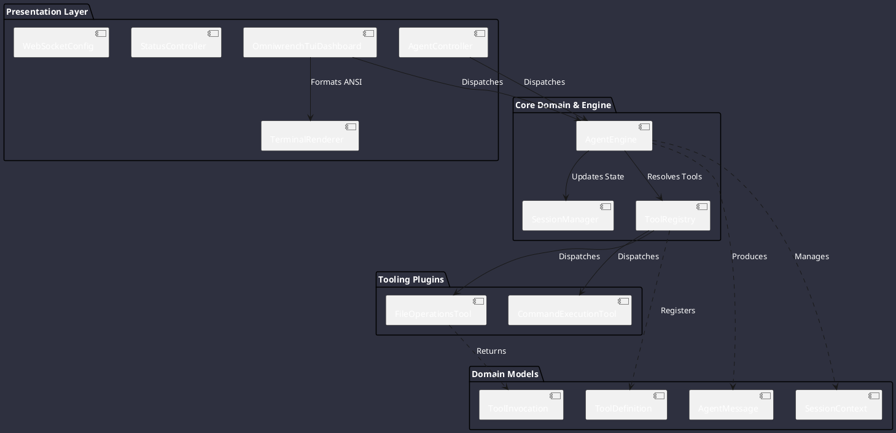

# System Components

Omniwrench segregates duties cleanly between presentation, reasoning, tool execution, and session management.

## Component Descriptions

1. **OmniwrenchTuiDashboard**: Provides an interactive terminal console with live status headers, prompt input, and colored chat panels.
2. **TerminalRenderer**: Low-level ANSI styling engine rendering glowing neon borders and status pills.
3. **AgentEngine**: Coordinates the reasoning cycle, command dispatches, and tool invocations within bounded thread limits.
4. **ToolRegistry**: Dynamic, thread-safe SPI registry storing registered tool capabilities.
5. **SessionManager**: Isolates session conversations and maps workspace roots.
6. **FileOperationsTool**: Safe filesystem operations supporting read, write, exists, and list actions.
7. **CommandExecutionTool**: Bounded shell process executor with timeout and output capture.
