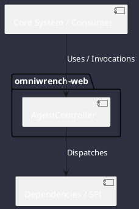

# Component: AgentController

## Component Metadata

| Property | Value |
|---|---|
| **Component Name** | `AgentController` |
| **Module** | `omniwrench-web` |
| **Tier** | Presentation Tier |
| **Package** | `com.omniwrench.web` |
| **Traceability** | [ADR-0011, ADR-0012](../../knowledge/knowledge_base.md) |

## Description

Spring Boot REST controller exposing secured endpoints for session creation, conversation turns, task DAG inspection, and tool invocation.

## Component Structure & Relationships

## Primary Responsibilities

- Handle HTTP POST `/api/v1/sessions/{id}/prompt`.
- Enforce `X-Api-Key` and JWT security filters.
- Return JSON session metadata and execution results.

## Related Architectural Links
- [System Components Overview](../components.md)
- [Module Dependencies](../dependencies.md)
- [Interfaces & SPIs](../interfaces.md)
- [Class Diagrams](../classes.md)
