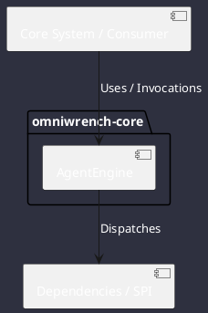

# Component: AgentEngine

## Component Metadata

| Property | Value |
|---|---|
| **Component Name** | `AgentEngine` |
| **Module** | `omniwrench-core` |
| **Tier** | Core Engine Tier |
| **Package** | `com.omniwrench.core` |
| **Traceability** | [ADR-0008, ADR-0016](../../knowledge/knowledge_base.md) |

## Description

Core asynchronous agent orchestrator coordinating prompt parsing, Smart Router model dispatch, tool execution loops, context management, and event emissions.

## Component Structure & Relationships

## Primary Responsibilities

- Manage conversational turn state machine (IDLE, THINKING, TOOL_EXEC, RESPONDING).
- Switch dynamically between single-step reactive loops and multi-step Plan-and-Execute DAGs.
- Emit lifecycle events to ReactorEventBus.

## Related Architectural Links
- [System Components Overview](../components.md)
- [Module Dependencies](../dependencies.md)
- [Interfaces & SPIs](../interfaces.md)
- [Class Diagrams](../classes.md)
