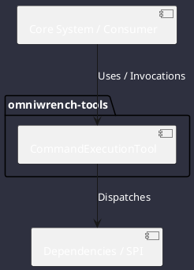

# Component: CommandExecutionTool

## Component Metadata

| Property | Value |
|---|---|
| **Component Name** | `CommandExecutionTool` |
| **Module** | `omniwrench-tools` |
| **Tier** | Tools & Protocol Tier |
| **Package** | `com.omniwrench.tools` |
| **Traceability** | [ADR-0007, ADR-0020](../../knowledge/knowledge_base.md) |

## Description

Sandboxed process execution tool managing background tasks, capturing stdout/stderr streams, enforcing execution timeouts, and integrating with CS-0070 guardrails.

## Component Structure & Relationships

## Primary Responsibilities

- Spawn subprocesses in workspace directory.
- Capture streaming output with timeout boundaries.
- Integrate with TaskManager to list, kill, or send input to running commands.

## Related Architectural Links
- [System Components Overview](../components.md)
- [Module Dependencies](../dependencies.md)
- [Interfaces & SPIs](../interfaces.md)
- [Class Diagrams](../classes.md)
