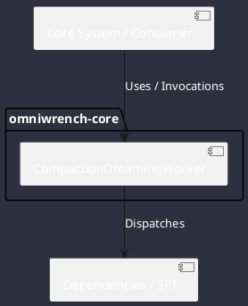

# Component: CompactionDreamingWorker

## Component Metadata

| Property | Value |
|---|---|
| **Component Name** | `CompactionDreamingWorker` |
| **Module** | `omniwrench-core` |
| **Tier** | Core Engine Tier |
| **Package** | `com.omniwrench.core` |
| **Traceability** | [ADR-0033](../../knowledge/knowledge_base.md) |

## Description

Asynchronous background worker monitoring token consumption, distilling conversation history into structured summary blocks, and rotating generational epochs.

## Component Structure & Relationships

## Primary Responsibilities

- Calculate context window saturation against 75% threshold.
- Prompt model to extract key decisions, active files, and pending items.
- Rotate epoch and archive old raw turns.

## Related Architectural Links
- [System Components Overview](../components.md)
- [Module Dependencies](../dependencies.md)
- [Interfaces & SPIs](../interfaces.md)
- [Class Diagrams](../classes.md)
