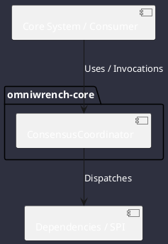

# Component: ConsensusCoordinator

## Component Metadata

| Property | Value |
|---|---|
| **Component Name** | `ConsensusCoordinator` |
| **Module** | `omniwrench-core` |
| **Tier** | Core Engine Tier |
| **Package** | `com.omniwrench.core` |
| **Traceability** | [ADR-0035](../../knowledge/knowledge_base.md) |

## Description

Structured consensus engine facilitating in-memory actor voting rounds with typed envelopes and quorum thresholds (>=66%).

## Component Structure & Relationships

## Primary Responsibilities

- Manage voting rounds and vote collection across swarm actors.
- Enforce configurable round timeouts.
- Determine consensus approval or rejection with structured justifications.

## Related Architectural Links
- [System Components Overview](../components.md)
- [Module Dependencies](../dependencies.md)
- [Interfaces & SPIs](../interfaces.md)
- [Class Diagrams](../classes.md)
