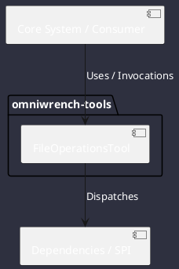

# Component: FileOperationsTool

## Component Metadata

| Property | Value |
|---|---|
| **Component Name** | `FileOperationsTool` |
| **Module** | `omniwrench-tools` |
| **Tier** | Tools & Protocol Tier |
| **Package** | `com.omniwrench.tools` |
| **Traceability** | [ADR-0007](../../knowledge/knowledge_base.md) |

## Description

Bounded filesystem manipulation tool implementing Tool SPI for safe file reading, writing, searching, directory listing, and atomic diff patching.

## Component Structure & Relationships

## Primary Responsibilities

- Read file contents with offset and slice support.
- Write file contents with workspace confinement checks.
- Perform ripgrep pattern matching and file discovery.

## Related Architectural Links
- [System Components Overview](../components.md)
- [Module Dependencies](../dependencies.md)
- [Interfaces & SPIs](../interfaces.md)
- [Class Diagrams](../classes.md)
