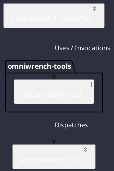

# Component: GitOperationsTool

## Component Metadata

| Property | Value |
|---|---|
| **Component Name** | `GitOperationsTool` |
| **Module** | `omniwrench-tools` |
| **Tier** | Tools & Protocol Tier |
| **Package** | `com.omniwrench.tools` |
| **Traceability** | [ADR-0007, ADR-0026](../../knowledge/knowledge_base.md) |

## Description

Git repository tool providing status inspection, diff extraction, hunk staging, conventional commit creation, and multi-remote push coordination.

## Component Structure & Relationships

## Primary Responsibilities

- Inspect git status and branch tracking.
- Generate unified diffs and stage selective hunks.
- Create commits with `[WIP]` tags and push to configured remotes.

## Related Architectural Links
- [System Components Overview](../components.md)
- [Module Dependencies](../dependencies.md)
- [Interfaces & SPIs](../interfaces.md)
- [Class Diagrams](../classes.md)
