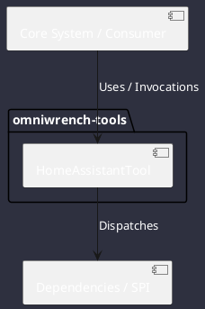

# Component: HomeAssistantTool

## Component Metadata

| Property | Value |
|---|---|
| **Component Name** | `HomeAssistantTool` |
| **Module** | `omniwrench-tools` |
| **Tier** | Tools & Protocol Tier |
| **Package** | `com.omniwrench.tools` |
| **Traceability** | [ADR-0029](../../knowledge/knowledge_base.md) |

## Description

Pluggable protocol bridge tool connecting Omniwrench to Home Assistant REST and WebSocket event APIs for IoT device inspection and automation triggers.

## Component Structure & Relationships

## Primary Responsibilities

- Query Home Assistant entity states and sensor telemetry.
- Call authorized Home Assistant service endpoints.
- Ingest real-time WebSocket state change events into ReactorEventBus.

## Related Architectural Links
- [System Components Overview](../components.md)
- [Module Dependencies](../dependencies.md)
- [Interfaces & SPIs](../interfaces.md)
- [Class Diagrams](../classes.md)
