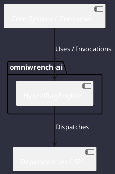

# Component: HybridRagEngine

## Component Metadata

| Property | Value |
|---|---|
| **Component Name** | `HybridRagEngine` |
| **Module** | `omniwrench-ai` |
| **Tier** | AI & Retrieval Tier |
| **Package** | `com.omniwrench.ai` |
| **Traceability** | [ADR-0027](../../knowledge/knowledge_base.md) |

## Description

Local knowledge retrieval engine combining BM25 keyword inverted indexing and local vector embeddings fused via Reciprocal Rank Fusion (RRF).

## Component Structure & Relationships

## Primary Responsibilities

- Index workspace source code, documentation, and markdown files.
- Execute BM25 lexical search alongside dense vector cosine similarity.
- Fuse candidate rankings using RRF to return high-precision context snippets.

## Related Architectural Links
- [System Components Overview](../components.md)
- [Module Dependencies](../dependencies.md)
- [Interfaces & SPIs](../interfaces.md)
- [Class Diagrams](../classes.md)
