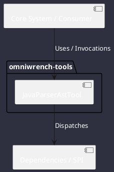

# Component: JavaParserAstTool

## Component Metadata

| Property | Value |
|---|---|
| **Component Name** | `JavaParserAstTool` |
| **Module** | `omniwrench-tools` |
| **Tier** | Tools & Protocol Tier |
| **Package** | `com.omniwrench.tools` |
| **Traceability** | [ADR-0024](../../knowledge/knowledge_base.md) |

## Description

AST code intelligence and refactoring tool using JavaParser 3.25+ with LexicalPreservingPrinter for comment-safe, formatting-preserving code modifications.

## Component Structure & Relationships

## Primary Responsibilities

- Parse Java source files into full AST syntax trees.
- Locate class, interface, method, and field declarations.
- Apply node modifications preserving original indentation and comments.

## Related Architectural Links
- [System Components Overview](../components.md)
- [Module Dependencies](../dependencies.md)
- [Interfaces & SPIs](../interfaces.md)
- [Class Diagrams](../classes.md)
