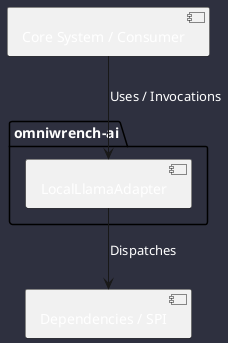

# Component: LocalLlamaAdapter

## Component Metadata

| Property | Value |
|---|---|
| **Component Name** | `LocalLlamaAdapter` |
| **Module** | `omniwrench-ai` |
| **Tier** | AI & Retrieval Tier |
| **Package** | `com.omniwrench.ai` |
| **Traceability** | [ADR-0004, ADR-0040](../../knowledge/knowledge_base.md) |

## Description

Air-gapped local model adapter connecting to embedded llama.cpp or Ollama endpoints on localhost for 100% offline inference.

## Component Structure & Relationships

## Primary Responsibilities

- Connect to `http://localhost:11434` or local socket.
- Stream completions with zero outbound telemetry.
- Support quantized GGUF models on CPU/GPU.

## Related Architectural Links
- [System Components Overview](../components.md)
- [Module Dependencies](../dependencies.md)
- [Interfaces & SPIs](../interfaces.md)
- [Class Diagrams](../classes.md)
