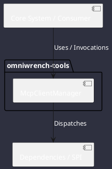

# Component: McpClientManager

## Component Metadata

| Property | Value |
|---|---|
| **Component Name** | `McpClientManager` |
| **Module** | `omniwrench-tools` |
| **Tier** | Tools & Protocol Tier |
| **Package** | `com.omniwrench.tools` |
| **Traceability** | [ADR-0036](../../knowledge/knowledge_base.md) |

## Description

Model Context Protocol client managing Stdio and SSE JSON-RPC connections to external tool servers declared in `.omniwrench/mcp-servers.json`.

## Component Structure & Relationships

## Primary Responsibilities

- Spawn external MCP server processes or establish SSE streams.
- Discover remote tools and register them dynamically in ToolRegistry.
- Marshal tool execution calls and unmarshal JSON-RPC responses.

## Related Architectural Links
- [System Components Overview](../components.md)
- [Module Dependencies](../dependencies.md)
- [Interfaces & SPIs](../interfaces.md)
- [Class Diagrams](../classes.md)
