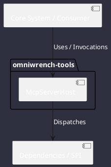

# Component: McpServerHost

## Component Metadata

| Property | Value |
|---|---|
| **Component Name** | `McpServerHost` |
| **Module** | `omniwrench-tools` |
| **Tier** | Tools & Protocol Tier |
| **Package** | `com.omniwrench.tools` |
| **Traceability** | [ADR-0036](../../knowledge/knowledge_base.md) |

## Description

Model Context Protocol server hosting Omniwrench's internal tools and workspace resources over Stdio or SSE for consumption by external IDEs.

## Component Structure & Relationships

## Primary Responsibilities

- Serve JSON-RPC 2.0 protocol over standard I/O or HTTP SSE.
- Advertise Omniwrench AST, file, and Home Assistant tools.
- Execute requested tool invocations safely and return results.

## Related Architectural Links
- [System Components Overview](../components.md)
- [Module Dependencies](../dependencies.md)
- [Interfaces & SPIs](../interfaces.md)
- [Class Diagrams](../classes.md)
