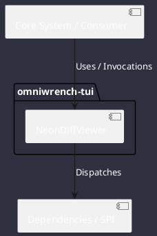

# Component: NeonDiffViewer

## Component Metadata

| Property | Value |
|---|---|
| **Component Name** | `NeonDiffViewer` |
| **Module** | `omniwrench-tui` |
| **Tier** | Presentation Tier |
| **Package** | `com.omniwrench.tui` |
| **Traceability** | [ADR-0026](../../knowledge/knowledge_base.md) |

## Description

Built-in interactive split-screen diff viewer providing hunk-by-hunk staging (s) and reverting (r) keyboard shortcuts with high-contrast neon green and red colorization.

## Component Structure & Relationships

## Primary Responsibilities

- Parse standard unified git diffs into structured patch hunks.
- Render side-by-side or inline colorized diff blocks.
- Allow interactive hunk selection and stage/revert execution.

## Related Architectural Links
- [System Components Overview](../components.md)
- [Module Dependencies](../dependencies.md)
- [Interfaces & SPIs](../interfaces.md)
- [Class Diagrams](../classes.md)
