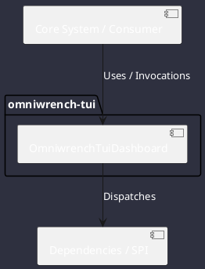

# Component: OmniwrenchTuiDashboard

## Component Metadata

| Property | Value |
|---|---|
| **Component Name** | `OmniwrenchTuiDashboard` |
| **Module** | `omniwrench-tui` |
| **Tier** | Presentation Tier |
| **Package** | `com.omniwrench.tui` |
| **Traceability** | [ADR-0005, ADR-0037, ADR-0043](../../knowledge/knowledge_base.md) |

## Description

Primary Lanterna-based terminal UI dashboard delivering a multi-pane Cyberpunk developer interface with glowing neon styling, modal Vim-inspired navigation, function keys (F1-F6), live status pills, and interactive modals.

## Component Structure & Relationships

## Primary Responsibilities

- Render multi-pane terminal layout (Chat history, tool execution, status HUD, diff viewer).
- Handle user keyboard input in command (Esc) and insert (i) modes.
- Display fuzzy-searchable slash command palette (/).
- Update top header and bottom footer HUD telemetry in real-time.

## Related Architectural Links
- [System Components Overview](../components.md)
- [Module Dependencies](../dependencies.md)
- [Interfaces & SPIs](../interfaces.md)
- [Class Diagrams](../classes.md)
