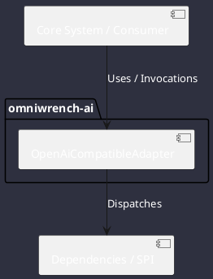

# Component: OpenAiCompatibleAdapter

## Component Metadata

| Property | Value |
|---|---|
| **Component Name** | `OpenAiCompatibleAdapter` |
| **Module** | `omniwrench-ai` |
| **Tier** | AI & Retrieval Tier |
| **Package** | `com.omniwrench.ai` |
| **Traceability** | [ADR-0004, ADR-0015](../../knowledge/knowledge_base.md) |

## Description

Universal HTTP/SSE client adapter implementing BackendAdapter for OpenAI-compatible REST endpoints (OpenAI, Groq, OpenRouter, vLLM, Ollama).

## Component Structure & Relationships

## Primary Responsibilities

- Serialize ModelRequest into OpenAI-compliant JSON payload.
- Stream SSE chunks reactively via Project Reactor Flux.
- Parse streaming tool call chunks and token counts.

## Related Architectural Links
- [System Components Overview](../components.md)
- [Module Dependencies](../dependencies.md)
- [Interfaces & SPIs](../interfaces.md)
- [Class Diagrams](../classes.md)
