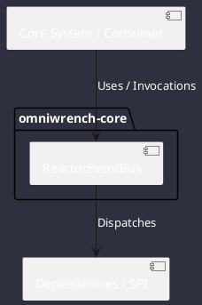

# Component: ReactorEventBus

## Component Metadata

| Property | Value |
|---|---|
| **Component Name** | `ReactorEventBus` |
| **Module** | `omniwrench-core` |
| **Tier** | Core Engine Tier |
| **Package** | `com.omniwrench.core` |
| **Traceability** | [ADR-0030](../../knowledge/knowledge_base.md) |

## Description

Non-blocking type-safe reactive event broker powered by Project Reactor `Sinks.Many<AgentEvent>` with multicast replay and backpressure support.

## Component Structure & Relationships

## Primary Responsibilities

- Publish typed event instances asynchronously.
- Distribute events to local TUI listeners and remote WebSocket handlers.
- Buffer events gracefully during sudden burst activity.

## Related Architectural Links
- [System Components Overview](../components.md)
- [Module Dependencies](../dependencies.md)
- [Interfaces & SPIs](../interfaces.md)
- [Class Diagrams](../classes.md)
