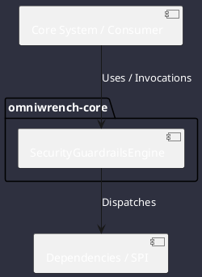

# Component: SecurityGuardrailsEngine

## Component Metadata

| Property | Value |
|---|---|
| **Component Name** | `SecurityGuardrailsEngine` |
| **Module** | `omniwrench-core` |
| **Tier** | Core Engine Tier |
| **Package** | `com.omniwrench.core` |
| **Traceability** | [ADR-0020](../../knowledge/knowledge_base.md) |

## Description

Multi-tier security gate validating workspace path containment and classifying shell/tool commands (Levels 1-9) to mandate human interactive clearance per CS-0070.

## Component Structure & Relationships

## Primary Responsibilities

- Validate that file read/write operations remain strictly within workspace boundaries.
- Classify shell commands against destructive keyword heuristics (rm, dd, mkfs, git push).
- Block Level >= 7 actions until explicit developer confirmation is provided.

## Related Architectural Links
- [System Components Overview](../components.md)
- [Module Dependencies](../dependencies.md)
- [Interfaces & SPIs](../interfaces.md)
- [Class Diagrams](../classes.md)
