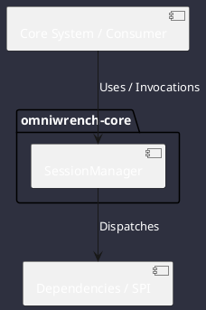

# Component: SessionManager

## Component Metadata

| Property | Value |
|---|---|
| **Component Name** | `SessionManager` |
| **Module** | `omniwrench-core` |
| **Tier** | Core Engine Tier |
| **Package** | `com.omniwrench.core` |
| **Traceability** | [ADR-0009](../../knowledge/knowledge_base.md) |

## Description

Persistence coordinator managing session contexts in `.omniwrench/sessions/{id}/` using atomic, array-free JSON files per turn to guarantee crash resistance.

## Component Structure & Relationships

## Primary Responsibilities

- Initialize new session directories and metadata files.
- Save individual turns atomically as separate JSON entities.
- Reload session history on resume or recovery.

## Related Architectural Links
- [System Components Overview](../components.md)
- [Module Dependencies](../dependencies.md)
- [Interfaces & SPIs](../interfaces.md)
- [Class Diagrams](../classes.md)
