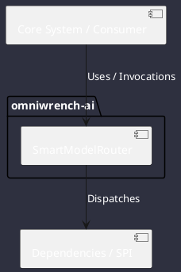

# Component: SmartModelRouter

## Component Metadata

| Property | Value |
|---|---|
| **Component Name** | `SmartModelRouter` |
| **Module** | `omniwrench-ai` |
| **Tier** | AI & Retrieval Tier |
| **Package** | `com.omniwrench.ai` |
| **Traceability** | [ADR-0019](../../knowledge/knowledge_base.md) |

## Description

Cost- and latency-optimized dynamic router analyzing prompt complexity (TRIVIAL, LOW, STANDARD, COMPLEX, EXPERT) and dispatching to the most efficient AI provider.

## Component Structure & Relationships

## Primary Responsibilities

- Evaluate prompt token count, code blocks, and reasoning requirements.
- Select target BackendAdapter and model configuration.
- Track token consumption and cost metrics per provider.

## Related Architectural Links
- [System Components Overview](../components.md)
- [Module Dependencies](../dependencies.md)
- [Interfaces & SPIs](../interfaces.md)
- [Class Diagrams](../classes.md)
