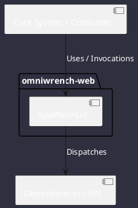

# Component: SpaWebHud

## Component Metadata

| Property | Value |
|---|---|
| **Component Name** | `SpaWebHud` |
| **Module** | `omniwrench-web` |
| **Tier** | Presentation Tier |
| **Package** | `com.omniwrench.web` |
| **Traceability** | [ADR-0018](../../knowledge/knowledge_base.md) |

## Description

Lightweight embedded Single-Page Application (Svelte/Vue 3) bundled in Spring Boot static resources, delivering browser-based HUD telemetry and chat dialogues.

## Component Structure & Relationships

## Primary Responsibilities

- Serve static web assets from `src/main/resources/static`.
- Render responsive web HUD matching Cyberpunk aesthetic.
- Connect to WebSocket STOMP endpoint for live streaming updates.

## Related Architectural Links
- [System Components Overview](../components.md)
- [Module Dependencies](../dependencies.md)
- [Interfaces & SPIs](../interfaces.md)
- [Class Diagrams](../classes.md)
