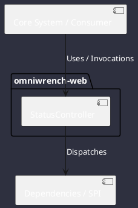

# Component: StatusController

## Component Metadata

| Property | Value |
|---|---|
| **Component Name** | `StatusController` |
| **Module** | `omniwrench-web` |
| **Tier** | Presentation Tier |
| **Package** | `com.omniwrench.web` |
| **Traceability** | [ADR-0011](../../knowledge/knowledge_base.md) |

## Description

Spring Boot REST controller providing system health, active profile, registered tools, memory utilization, and uptime telemetry.

## Component Structure & Relationships

## Primary Responsibilities

- Handle HTTP GET `/api/v1/status`.
- Expose engine health metrics and JVM performance stats.
- Provide liveness and readiness probe endpoints for containers.

## Related Architectural Links
- [System Components Overview](../components.md)
- [Module Dependencies](../dependencies.md)
- [Interfaces & SPIs](../interfaces.md)
- [Class Diagrams](../classes.md)
