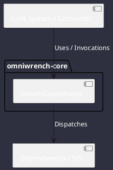

# Component: SwarmCoordinator

## Component Metadata

| Property | Value |
|---|---|
| **Component Name** | `SwarmCoordinator` |
| **Module** | `omniwrench-core` |
| **Tier** | Core Engine Tier |
| **Package** | `com.omniwrench.core` |
| **Traceability** | [ADR-0017](../../knowledge/knowledge_base.md) |

## Description

Multi-agent swarm orchestrator managing hierarchical supervisor delegation and spawning ephemeral peer-to-peer subagent worker actors.

## Component Structure & Relationships

## Primary Responsibilities

- Spawn lightweight virtual-thread subagent workers.
- Dispatch sub-goals to specialized agent roles (Coder, Reviewer, Tester).
- Aggregate subagent reports into unified parent context.

## Related Architectural Links
- [System Components Overview](../components.md)
- [Module Dependencies](../dependencies.md)
- [Interfaces & SPIs](../interfaces.md)
- [Class Diagrams](../classes.md)
