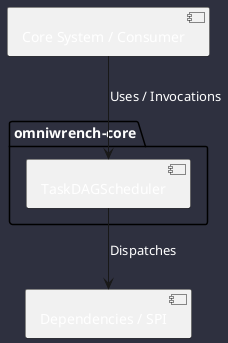

# Component: TaskDAGScheduler

## Component Metadata

| Property | Value |
|---|---|
| **Component Name** | `TaskDAGScheduler` |
| **Module** | `omniwrench-core` |
| **Tier** | Core Engine Tier |
| **Package** | `com.omniwrench.core` |
| **Traceability** | [ADR-0021](../../knowledge/knowledge_base.md) |

## Description

Task graph execution engine managing Plan-and-Execute DAGs with step dependency resolution and atomic checkpoint persistence in `.omniwrench/tasks/`.

## Component Structure & Relationships

## Primary Responsibilities

- Construct topological DAG execution order for task steps.
- Record step status changes atomically to disk.
- Resume unfinished task DAGs automatically upon restart.

## Related Architectural Links
- [System Components Overview](../components.md)
- [Module Dependencies](../dependencies.md)
- [Interfaces & SPIs](../interfaces.md)
- [Class Diagrams](../classes.md)
