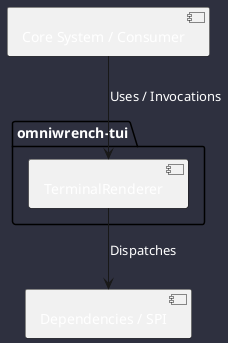

# Component: TerminalRenderer

## Component Metadata

| Property | Value |
|---|---|
| **Component Name** | `TerminalRenderer` |
| **Module** | `omniwrench-tui` |
| **Tier** | Presentation Tier |
| **Package** | `com.omniwrench.tui` |
| **Traceability** | [ADR-0013](../../knowledge/knowledge_base.md) |

## Description

Context-adaptive ANSI and TrueColor terminal renderer handling SIGWINCH window resize events and dynamic panel folding across varying column widths (<80, 80-139, 140-159, >=160 cols).

## Component Structure & Relationships

## Primary Responsibilities

- Detect terminal terminal dimensions and character capabilities.
- Dynamically calculate pane layout dimensions on resize.
- Render borders, text boxes, and ANSI styling efficiently.

## Related Architectural Links
- [System Components Overview](../components.md)
- [Module Dependencies](../dependencies.md)
- [Interfaces & SPIs](../interfaces.md)
- [Class Diagrams](../classes.md)
