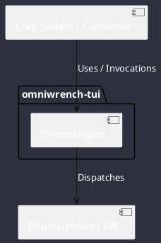

# Component: ThemeEngine

## Component Metadata

| Property | Value |
|---|---|
| **Component Name** | `ThemeEngine` |
| **Module** | `omniwrench-tui` |
| **Tier** | Presentation Tier |
| **Package** | `com.omniwrench.tui` |
| **Traceability** | [ADR-0034](../../knowledge/knowledge_base.md) |

## Description

Adaptive multi-theme engine supporting 24-bit TrueColor to 256/16 ANSI palette quantization, with dynamic JSON theme loading from `.omniwrench/themes/`.

## Component Structure & Relationships

## Primary Responsibilities

- Load built-in themes (Cyberpunk, Dracula, Nord, Monokai, Matrix, Gruvbox, High-Contrast).
- Quantize RGB 24-bit values to target terminal ANSI capabilities.
- Provide runtime theme switching via F6 or `/theme` command.

## Related Architectural Links
- [System Components Overview](../components.md)
- [Module Dependencies](../dependencies.md)
- [Interfaces & SPIs](../interfaces.md)
- [Class Diagrams](../classes.md)
