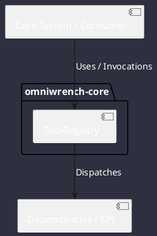

# Component: ToolRegistry

## Component Metadata

| Property | Value |
|---|---|
| **Component Name** | `ToolRegistry` |
| **Module** | `omniwrench-core` |
| **Tier** | Core Engine Tier |
| **Package** | `com.omniwrench.core` |
| **Traceability** | [ADR-0006, ADR-0010](../../knowledge/knowledge_base.md) |

## Description

Thread-safe tool registry discovering built-in tool components and external plugin JARs via Java ServiceLoader in isolated child classloaders.

## Component Structure & Relationships

## Primary Responsibilities

- Register tool instances implementing `com.omniwrench.tools.Tool`.
- Scan `plugins/` directory for drop-in JAR extensions.
- Provide tool schema descriptors to LLM inference payloads.

## Related Architectural Links
- [System Components Overview](../components.md)
- [Module Dependencies](../dependencies.md)
- [Interfaces & SPIs](../interfaces.md)
- [Class Diagrams](../classes.md)
