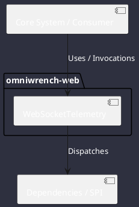

# Component: WebSocketTelemetry

## Component Metadata

| Property | Value |
|---|---|
| **Component Name** | `WebSocketTelemetry` |
| **Module** | `omniwrench-web` |
| **Tier** | Presentation Tier |
| **Package** | `com.omniwrench.web` |
| **Traceability** | [ADR-0018](../../knowledge/knowledge_base.md) |

## Description

Spring WebSocket STOMP message broker hub broadcasting real-time agent reasoning steps, subagent swarm votes, Home Assistant events, and tool logs to connected browser clients.

## Component Structure & Relationships

## Primary Responsibilities

- Manage WebSocket client connections on `/ws/telemetry`.
- Subscribe to ReactorEventBus events.
- Publish events to `/topic/telemetry/**` STOMP topics.

## Related Architectural Links
- [System Components Overview](../components.md)
- [Module Dependencies](../dependencies.md)
- [Interfaces & SPIs](../interfaces.md)
- [Class Diagrams](../classes.md)
