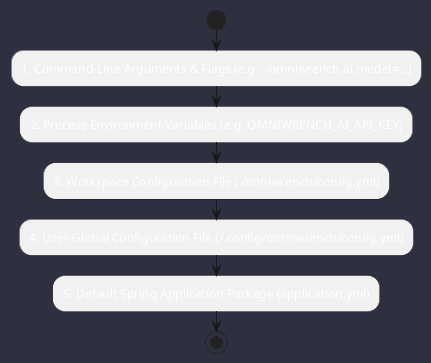

# Configuration Specifications & Hierarchy

Omniwrench implements a **Hierarchical Configuration Layering Architecture** with strict automated secrets masking and local AES-256 vault encryption per **ADR-0031**.

## 1. Precedence Hierarchy (Highest to Lowest)

## 2. Configuration Properties Reference

| Property Path | Environment Variable | Default Value | Description |
|---|---|---|---|
| `server.port` | `PORT` | `8080` | Spring Boot HTTP / WebSocket listening port |
| `omniwrench.mode` | `OMNIWRENCH_MODE` | `dual` | Execution mode: `dual`, `tui`, `web` |
| `omniwrench.workspace-path` | `OMNIWRENCH_WORKSPACE` | `.` | Root path of targeted workspace |
| `omniwrench.ai.default-provider` | `OMNIWRENCH_AI_PROVIDER` | `openai` | Active AI provider (`openai`, `anthropic`, `gemini`, `ollama`) |
| `omniwrench.ai.api-key` | `OMNIWRENCH_AI_API_KEY` | *[masked]* | Sensitive API authentication key (masked in logs) |
| `omniwrench.ai.model` | `OMNIWRENCH_AI_MODEL` | `gpt-4o` | Primary reasoning model identifier |
| `omniwrench.ai.smart-routing.enabled` | `OMNIWRENCH_ROUTER_ENABLED` | `true` | Enable dynamic cost/latency smart model router |
| `omniwrench.tui.theme` | `OMNIWRENCH_TUI_THEME` | `cyberpunk` | Active ANSI color theme (`cyberpunk`, `dracula`, `nord`) |
| `omniwrench.tui.fps-target` | `OMNIWRENCH_TUI_FPS` | `30` | Target render frames per second |
| `omniwrench.engine.max-reasoning-steps` | `OMNIWRENCH_MAX_STEPS` | `50` | Maximum reasoning iterations per user turn |
| `omniwrench.engine.max-threads` | `OMNIWRENCH_MAX_THREADS` | `8` | Bounded worker thread allocation limit |
| `omniwrench.engine.compaction-threshold` | `OMNIWRENCH_COMPACT_THRESH` | `0.75` | Context window fill fraction triggering dreaming compaction |
| `omniwrench.protocol.home-assistant.url` | `HA_URL` | `http://localhost:8123` | Home Assistant instance REST / WebSocket URL |
| `omniwrench.protocol.home-assistant.token` | `HA_TOKEN` | *[masked]* | Home Assistant Long-Lived Access Token |
| `omniwrench.security.api-key` | `OMNIWRENCH_SECURITY_KEY` | *[auto-gen]* | Master `X-Api-Key` required for Web & WebSocket access |
| `omniwrench.security.vault-file` | `OMNIWRENCH_VAULT_FILE` | `.omniwrench/secrets.enc` | Path to AES-256 encrypted local secrets vault |

