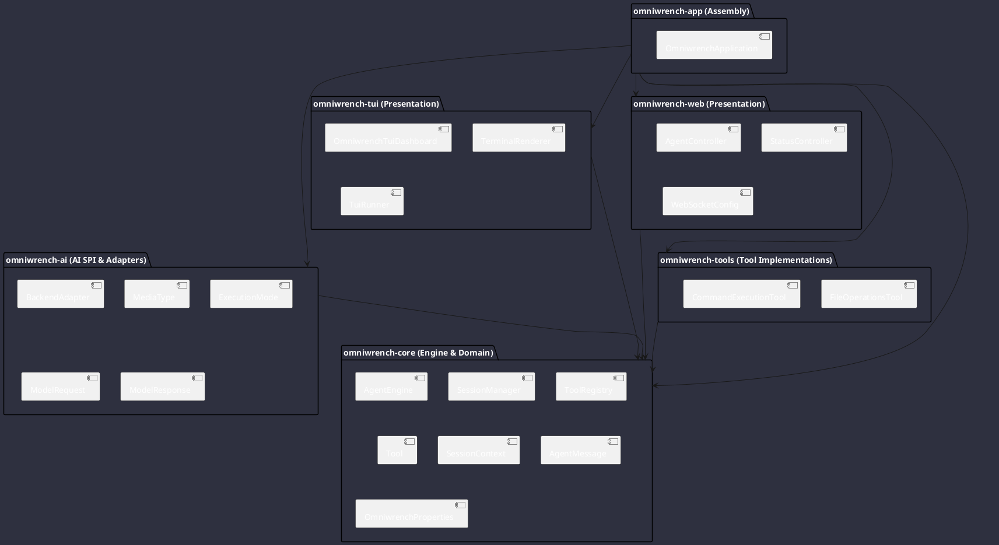

# Module & Package Dependencies

The following diagram illustrates Maven module dependencies and package boundaries within Omniwrench (per ADR-0016):

## Coupling & Design Principles
- **Clean Inversion**: The `omniwrench-core` module contains pure engine logic, domain models, and SPIs without heavy runtime dependencies.
- **Pluggable AI SPI**: The `omniwrench-ai` module defines the `BackendAdapter` and `MediaType` sealed hierarchy without framework lock-in (ADR-0015).
- **Pluggable Tools**: The `omniwrench-tools` module implements the `Tool` SPI and is discovered dynamically via Spring or `ServiceLoader` (ADR-0010).
- **Dual Presentation**: Both `omniwrench-tui` and `omniwrench-web` act as peer presentation consumers of `omniwrench-core` (ADR-0001, ADR-0011).

