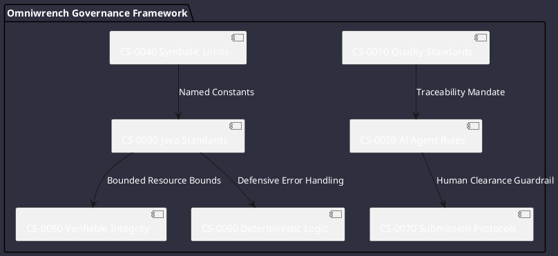

# Navigation by Project Rules & Guidelines

This index organizes the Omniwrench quality gatekeepers, AI automation regulations, and coding standard constraints.

---

## 📋 Rules Registry

1. [Constraint CS-0010: Project Quality Standards](CS-0010.md)
   - Mandatory unique structured references (`REQ-XXXXX`, `FR-XXXXX`, `TSK-XXXXX`, `BUG-XXXXX`, `FIX-XXXXX`).
   - Granular code traceability down to methods, fields, and logical blocks.

2. [Constraint CS-0020: AI Agent Rules and Standards](CS-0020.md)
   - Agent self-evaluation, impact analysis, natural language explanations.
   - Step-by-step workflow for new features and bug fixes.
   - Mandatory human validation for architectural modifications and commits.

3. [Constraint CS-0030: Java Programming Language Standards](CS-0030.md)
   - Defensive precondition checks (`Objects.requireNonNull`, range validation).
   - Zero null-passing / returning across boundaries.
   - Bounded object pools, bounded thread pools.
   - Strict explicit typing (strict exclusion of `var`).
   - Mandatory `try-with-resources`.

4. [Constraint CS-0040: Prohibition of Literal Magic Numbers](CS-0040.md)
   - All limits, timeouts, and configuration values represented as named symbolic constants (`UPPER_SNAKE_CASE`).
   - Explicit waivers required for exceptions.

5. [Constraint CS-0050: Verifiable Integrity and Safety Standards](CS-0050.md)
   - Bounded stack depth, memory safety profiles, and explicit bounds checking.

6. [Constraint CS-0055: Zero-Mock Production Mandate & Runtime Realism](CS-0055.md)
   - Zero mock frameworks or dummy returns in production code paths (`src/main`).
   - Verifiable real I/O, subprocess invocations, and cryptographic asset validation.

7. [Constraint CS-0060: High-Integrity and Deterministic Logic](CS-0060.md)
   - Total branching on all conditional logic (`else` mandatory).
   - Variable shadowing prevention.
   - Exception-safe lifecycle hooks.

8. [Constraint CS-0070: Agent Operational Standards and Submission Protocols](CS-0070.md)
   - Mandatory human clearance before `git commit` or `git push`.
   - Local build pass, full test pass, and deletion analysis before submission requests.
