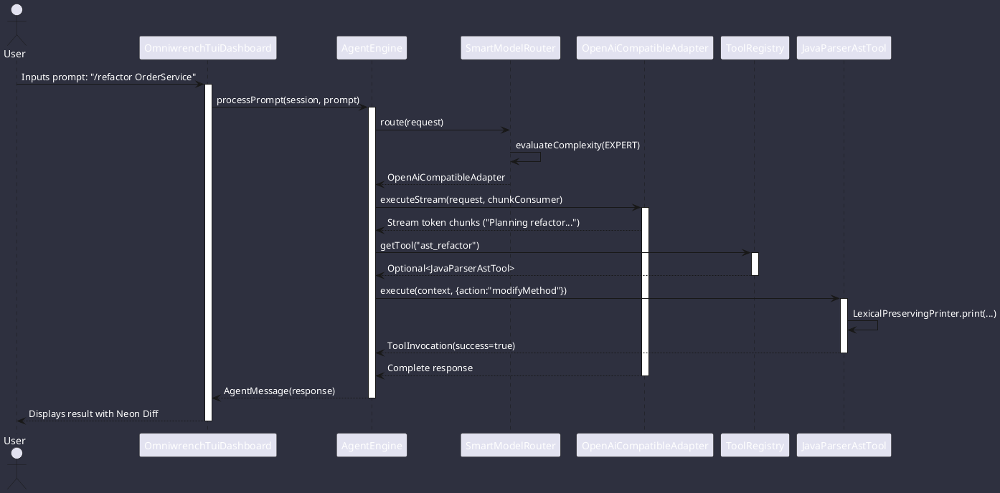
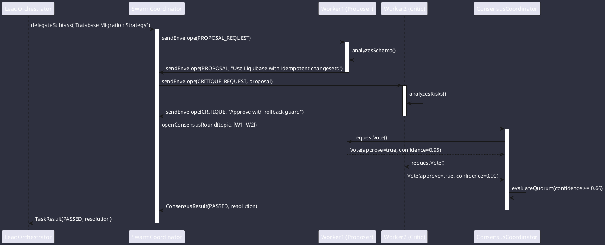
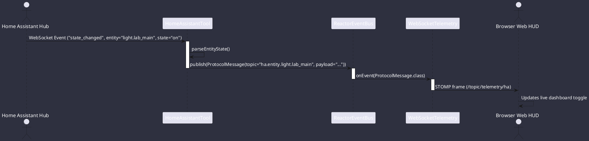
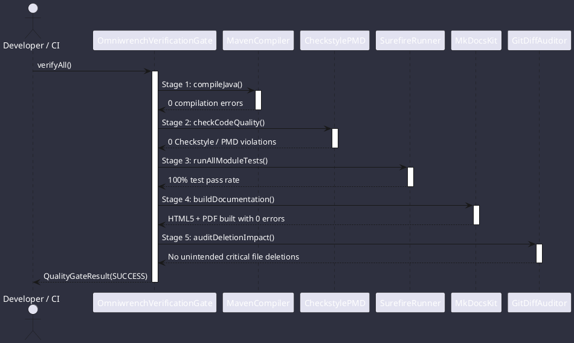

# Execution Sequences

Detailed sequence diagrams illustrating message flows, tool executions, AI streaming, swarm consensus, and protocol bridges across Omniwrench.

## 1. Interactive TUI Reasoning & Smart Router Sequence

## 2. Dynamic Subagent Swarm Consensus Protocol Sequence

## 3. Pluggable Protocol Bridge & Home Assistant Telemetry Sequence

## 4. 5-Stage Verification Quality Gate Sequence

