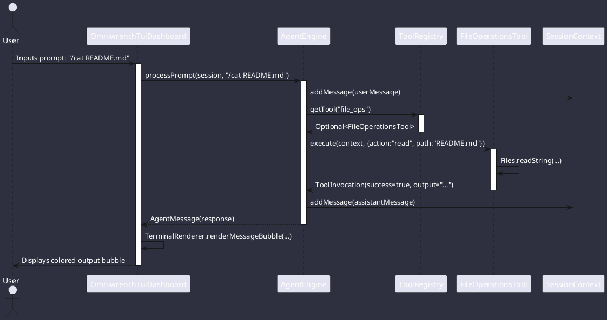
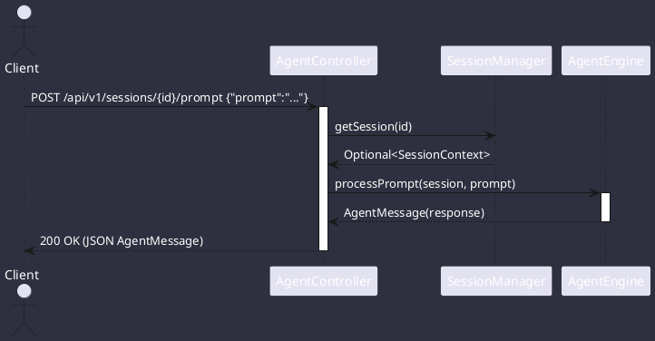

# Execution Sequences

## 1. Interactive TUI Reasoning & Tool Invocation Sequence

```plantuml
@startuml
skinparam backgroundColor #2e303f
skinparam defaultFontColor #ffffff

actor User as U
participant "OmniwrenchTuiDashboard" as TUI
participant "AgentEngine" as ENG
participant "ToolRegistry" as REG
participant "FileOperationsTool" as TOOL
participant "SessionContext" as CTX

U -> TUI : Inputs prompt: "/cat README.md"
activate TUI

TUI -> ENG : processPrompt(session, "/cat README.md")
activate ENG

ENG -> CTX : addMessage(userMessage)

ENG -> REG : getTool("file_ops")
activate REG
REG --> ENG : Optional<FileOperationsTool>
deactivate REG

ENG -> TOOL : execute(context, {action:"read", path:"README.md"})
activate TOOL
TOOL -> TOOL : Files.readString(...)
TOOL --> ENG : ToolInvocation(success=true, output="...")
deactivate TOOL

ENG -> CTX : addMessage(assistantMessage)
ENG --> TUI : AgentMessage(response)
deactivate ENG

TUI -> TUI : TerminalRenderer.renderMessageBubble(...)
TUI --> U : Displays colored output bubble
deactivate TUI
@enduml
```

## 2. Web REST Execution Sequence

```plantuml
@startuml
skinparam backgroundColor #2e303f
skinparam defaultFontColor #ffffff

actor Client as C
participant "AgentController" as REST
participant "SessionManager" as SESS
participant "AgentEngine" as ENG

C -> REST : POST /api/v1/sessions/{id}/prompt {"prompt":"..."}
activate REST

REST -> SESS : getSession(id)
SESS --> REST : Optional<SessionContext>

REST -> ENG : processPrompt(session, prompt)
activate ENG
ENG --> REST : AgentMessage(response)
deactivate ENG

REST --> C : 200 OK (JSON AgentMessage)
deactivate REST
@enduml
```
