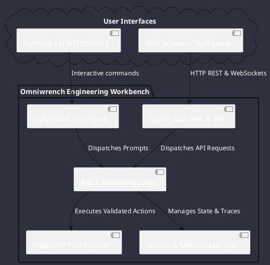

# Omniwrench 🛠️

**Omniwrench** is an autonomous, high-performance AI agent development framework and dual-interface engineering workbench built in Java (Spring Boot 3.2+), inspired by **OpenCode** and **OpenClaw**.

---

## 🧭 Navigation Quick Links

* [Topics Index](topics_index.md): Exhaustive sitemap of documentation.
* [User Guide](user_guide/overview.md): Getting started, CLI/TUI operations, and Web dashboard.
* [Architecture Specifications](architecture/architecture_index.md): Detailed component, sequence, activity, and class diagrams.
* [Project Rules & Standards](architecture/rules_index.md): Mission-critical constraints (`CS-0010` to `CS-0070`).
* [Requirements Register](requirements/requirements_index.md): Formal requirement catalogue (`REQ-00001` to `REQ-00050`).
* [Features Register](features/features_index.md): Functional capability specifications (`FR-00001` to `FR-00030`).
* [Use Cases](use_cases/use_cases_index.md): Operational scenarios and interaction diagrams (`UC-00001` to `UC-00020`).
* [Project Management & Tasks](project/project_management.md): 2026-2029 Industrial Infrastructure plan and task records.
* [Knowledge Base](knowledge/knowledge_base.md): Continuous project memory and architectural decisions.
