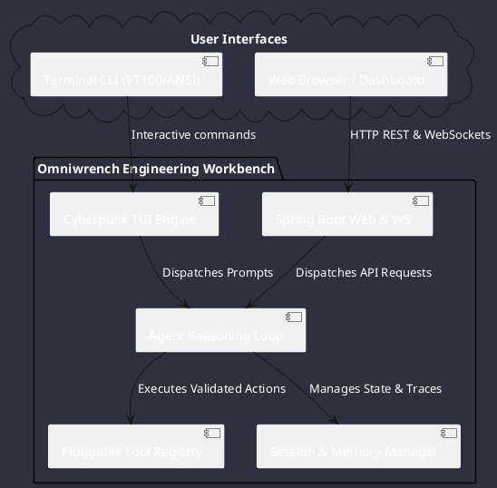

# Omniwrench 🛠️

**Omniwrench** is an autonomous, high-performance AI agent development framework and dual-interface engineering workbench built in Java (Spring Boot 3.2+), inspired by **OpenCode** and **OpenClaw**.

---

## 🧭 Navigation & Core Catalogs

* **[Topics Index](topics_index.md)**: Exhaustive sitemap of all 100+ documentation pages.
* **[User Guide](user_guide/overview.md)**: [Quick Start](user_guide/overview.md), [Cyberpunk TUI Manual](user_guide/tui_guide.md), [Web Dashboard](user_guide/web_guide.md), [Configuration](user_guide/configuration_guide.md), [Workflows](user_guide/workflows.md).
* **[Architecture Specifications](architecture/architecture_index.md)**:
  - [System Components](architecture/components.md) (28 dedicated component pages: `OmniwrenchTuiDashboard`, `AgentEngine`, `SmartModelRouter`, `JavaParserAstTool`, etc.)
  - [Package Dependencies](architecture/dependencies.md) & [Execution Sequences](architecture/sequences.md)
  - [Reasoning Activities](architecture/activities.md) & [Class Diagrams](architecture/classes.md)
  - [Interfaces & SPIs](architecture/interfaces.md), [File Formats](architecture/file_formats.md), [Configuration](architecture/configuration.md)
* **[Requirements Register](requirements/requirements_index.md)**: 42 dedicated requirement specifications (`REQ-00001` through `REQ-00085`).
* **[Features Register](features/features_index.md)**: 41 functional capability definitions (`FR-00001` through `FR-00041`).
* **[Use Cases Register](use_cases/use_cases_index.md)**: 12 dedicated operational scenario specifications (`UC-00001` through `UC-00012`).
* **[Project Management & Tasks](project/project_management.md)**: 2026-2029 Industrial Infrastructure governance and active task records (`TSK-20260822-001` to `TSK-20260822-006`).
* **[Project Rules & Standards](architecture/rules_index.md)**: Mission-critical constraints (`CS-0010` to `CS-0070`).
* **[Comparative Extraction Reports](reports/reports_index.md)**: Deep analysis of Antigravity SDK, OpenClaw, and OpenCode.
* **[Knowledge Base & ADRs](knowledge/knowledge_base.md)**: Architectural Decision Records (`ADR-0001` to `ADR-0044`).
