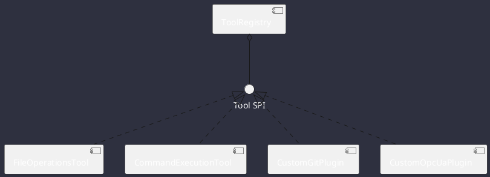

# Plugins Architecture

Omniwrench provides an open SPI model allowing engineers to implement custom tools and subagents.

## Creating a Plugin
Implement `com.omniwrench.tools.Tool`, annotate the class with `@Component`, and Spring Boot will automatically discover and register it in `ToolRegistry`.
