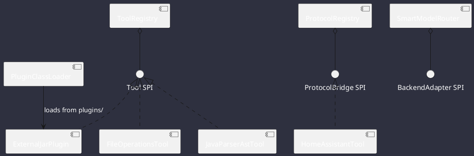

# Plugins & Extensibility Architecture

Omniwrench provides a dual plugin architecture supporting both compile-time Spring `@Component` scanning and runtime dynamic JAR loading via Java `ServiceLoader` SPI with child classloader isolation (**ADR-0010**).

## Plugin Types & Extension Points

### 1. Tool SPI Plugins (`com.omniwrench.tools.Tool`)
- **Built-in Plugins**: Filesystem, Bounded Shell Execution, AST analysis via JavaParser (`ADR-0024`), Git operations, Home Assistant.
- **External Drop-in JARs**: Drop any `.jar` implementing `Tool` and containing `META-INF/services/com.omniwrench.tools.Tool` into the `plugins/` directory. Omniwrench dynamically loads them into isolated `URLClassLoader` instances.

### 2. Protocol Bridge Plugins (`com.omniwrench.protocol.ProtocolBridge`)
- Implement `ProtocolBridge` to connect new message brokers, IoT endpoints, or custom network services (MQTT, CoAP, BLE, Modbus) into the reactive `ReactorEventBus` mesh (`ADR-0029`).

### 3. AI Backend Adapters (`com.omniwrench.ai.BackendAdapter<T>`)
- Implement custom inference engines (e.g. specialized fine-tuned models, local GGML/GGUF runtimes, TensorRT-LLM, PyTorch bindings) conforming to the typed `MediaType` contract (`ADR-0015`).

### 4. Model Context Protocol (MCP) Plugins (`ADR-0036`)
- External tool servers configured in `.omniwrench/mcp-servers.json` are dynamically discovered over Stdio / SSE JSON-RPC and registered into `ToolRegistry`.

