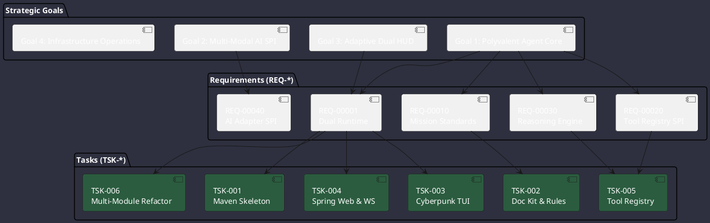

# Goal, Task & Requirements Governance

This document establishes the strict **Goal-, Task-, Requirement-, and Test-Oriented Governance** system for Omniwrench (ADR-0023), replacing fixed calendar schedules with rigorous outcome-based execution and traceability.

---

## 🎯 Global Constraints & Resource Boundaries

* **Project Time Allocation**: Maximum **1,600 hours / year** allocated to infrastructure and framework engineering.
* **Hardware Capital Budget**: Total **€400,000** allocated over 2026-2029 (Target rate: **€100,000 / year**).
* **Team Allocation**: **3.0 FTE** (1.5 FTE Internal + 1.5 FTE External).
* **Critical Operational Tasks**:
  1. Debian 11 & SUSE 15 SP6 Operating System Migrations.
  2. NetApp Storage Infrastructure Replacement (2029).
* **Tooling Standard**: PlantUML (v1.2020.02 compatibility enforced), Python cost analysis modeling.

---

## 📋 Active Tasks Register

| Task Reference | Title | Owner | Status |
|---|---|---|---|
| [`TSK-20260822-001`](tasks/TSK-20260822-001.md) | Project Initialization & Maven Dual Skeleton Setup | AI Agent | Completed |
| [`TSK-20260822-002`](tasks/TSK-20260822-002.md) | Documentation Kit Setup & Quality Standards Incorporation | AI Agent | Completed |
| [`TSK-20260822-003`](tasks/TSK-20260822-003.md) | Modern Cyberpunk TUI Design & Integration | AI Agent | Completed |
| [`TSK-20260822-004`](tasks/TSK-20260822-004.md) | Spring Web & Reactive WebSocket Server Engine | AI Agent | Completed |
| [`TSK-20260822-005`](tasks/TSK-20260822-005.md) | Pluggable Tool Registry & Agent Execution Loop | AI Agent | Completed |
| [`TSK-20260822-006`](tasks/TSK-20260822-006.md) | Maven Multi-Module Modular Architecture Restructuring | AI Agent | Completed |
| [`TSK-20260822-007`](tasks/TSK-20260822-007.md) | Dual Chat Mode & Thinking Stream Demultiplexing | AI Agent | Completed |
| [`TSK-20260822-008`](tasks/TSK-20260822-008.md) | Unified Tri-Interface Prompting & E2E Test Suite | AI Agent | Completed |

| [`TSK-20260822-009`](tasks/TSK-20260822-009.md) | Embedded llama.cpp LLM Backend Plugin & Native FFM Binding | AI Agent | Completed |
| [`TSK-20260822-010`](tasks/TSK-20260822-010.md) | Ollama & HuggingFace Model Hub Repository Manager | AI Agent | Completed |
| [`TSK-20260822-011`](tasks/TSK-20260822-011.md) | Advanced File Operations & Background Tool Plugin | AI Agent | Completed |
| [`TSK-20260822-012`](tasks/TSK-20260822-012.md) | Ultra-Precise OpenAPI & JSON Schema Function Calling Registry | AI Agent | Completed |
| [`TSK-20260822-013`](tasks/TSK-20260822-013.md) | Zero-Mock Runtime Quality Mandate & Automated Gate | AI Agent | Completed |
| [`TSK-20260822-014`](tasks/TSK-20260822-014.md) | GraalVM SDK Integration & Dual Packaging Profiles | AI Agent | Completed |
| [`TSK-20260822-015`](tasks/TSK-20260822-015.md) | In-Process Embedded llama.cpp Engine for Various CPU/GPU Architectures | AI Agent | Completed |

