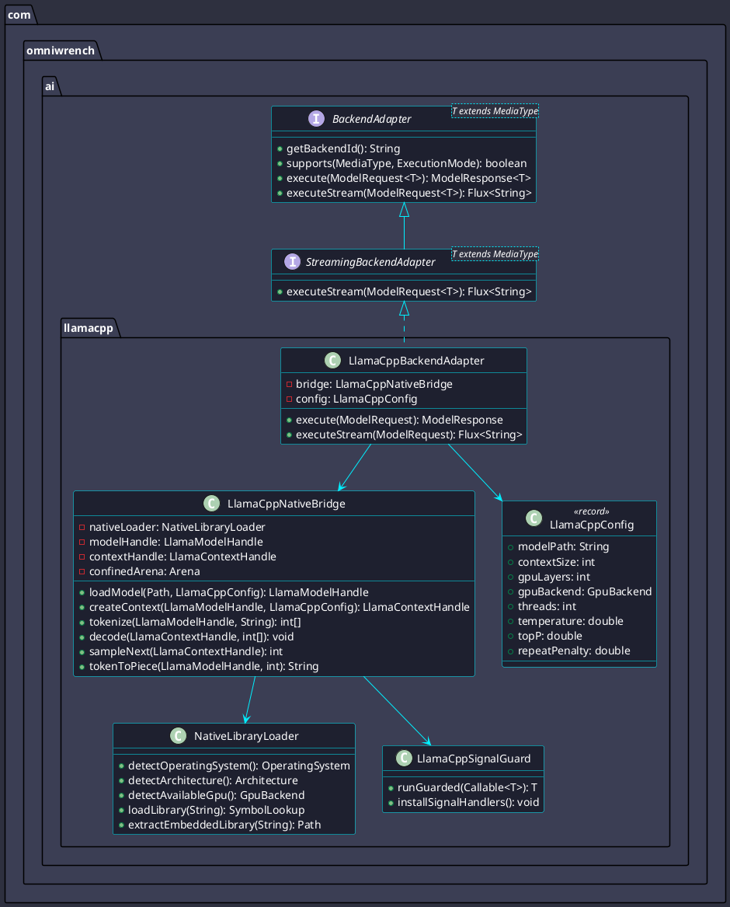
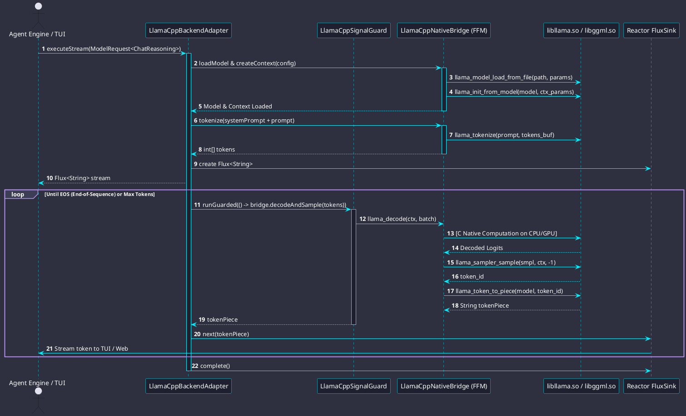
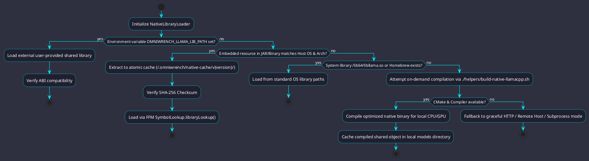
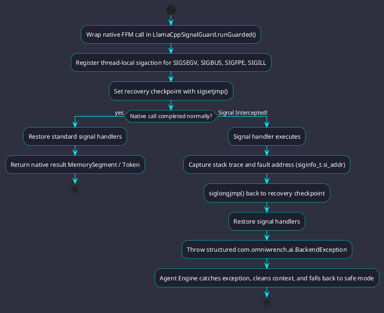
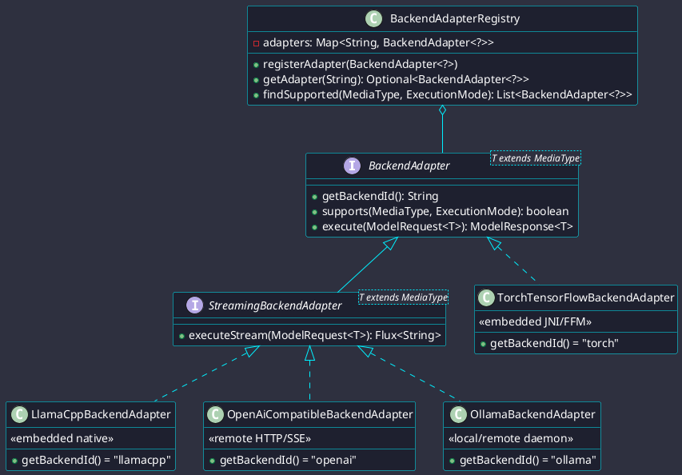
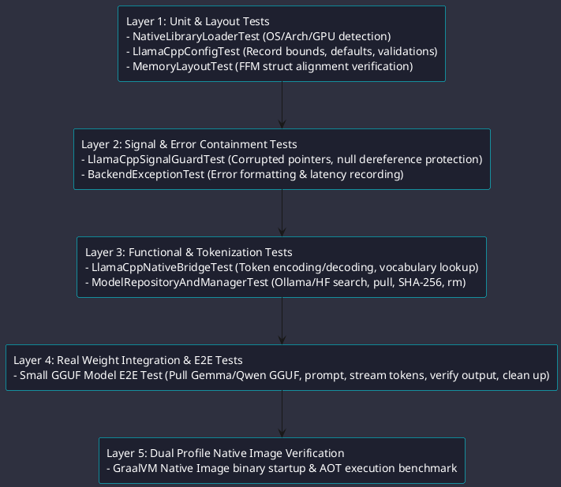

# Goal
In-Process Embedded llama.cpp Native Engine with Cross-Platform CPU/GPU Architectures for JVM and GraalVM Native Profiles

# Details

## Context
Omniwrench requires a self-contained, in-process LLM inference engine embedding `llama.cpp` and `ggml` shared libraries without relying on external system CLI binaries. The implementation must support cross-architecture execution (x86_64 AVX2/AVX512, ARM64 Neon, Apple Metal, Vulkan/CUDA GPU) and work identically across both standard JVM and GraalVM Native Image profiles.

## Architecture & Class Model

## Native Execution & Token Streaming Flow

## Third-Party Binary Resolution Strategy

## Low-Level C++ Crash & Signal Containment

## Universal Multi-Provider AI SPI

## Multi-Layered Test Pyramid Design

## Risk, Limitation & Mitigation Matrix

| Risk / Limitation | Severity | Root Cause | Architectural Mitigation in Omniwrench |
| :--- | :--- | :--- | :--- |
| **Native Segfault / Crash** | **Critical** | Corrupt GGUF weights, null pointers, out-of-bounds context. | Implement `LlamaCppSignalGuard` using POSIX signal handling (`sigaction` trapping `SIGSEGV`, `SIGBUS`, `SIGFPE`, `SIGILL`) and `siglongjmp` back into safe Java boundary. |
| **Native Off-Heap Memory Leak** | **High** | Forgetting to free large KV cache or model tensor weights. | Encapsulate all native handles in `AutoCloseable` wrappers tied to scoped Java `Arena.ofConfined()` or deterministic `SessionContext` lifecycles. |
| **GPU Driver Incompatibility** | **Medium** | Missing CUDA toolkit, outdated Vulkan loaders, driver mismatch. | Safe fallback cascade: CUDA -> ROCm -> Vulkan -> CPU AVX2. If GPU initialization fails, automatically restart context on pure CPU SIMD. |
| **Platform ABI Divergence** | **Medium** | Structure padding and pointer sizing differences between OSes. | Use explicit FFM `ValueLayout.JAVA_LONG`, `JAVA_INT`, and `ADDRESS` layouts rather than hardcoded byte offsets. |
| **GraalVM AOT Build Time** | **Low** | Static analysis overhead of native libraries. | Isolate native symbol lookup behind dynamic runtime initializers (`--initialize-at-run-time=com.omniwrench.ai.llamacpp`). |

## Requirements
- [x] [TSK-20260822-015.1] Create `omniwrench-ai` native shared library loader (`NativeLibraryLoader`) detecting OS and architecture (`linux-x86_64`, `linux-aarch64`, `macos-arm64`, `windows-x86_64`) and extracting bundled prebuilts. (Traceability: `REQ-00090`, `REQ-00093`).
- [x] [TSK-20260822-015.2] Implement Java 22+ Foreign Function & Memory (FFM) / JNI in-process bindings (`LlamaCppNativeBridge`) for `llama_backend_init`, `llama_model_load_from_file`, `llama_init_from_model`, `llama_tokenize`, `llama_decode`, and token samplers. (Traceability: `REQ-00090`, `REQ-00093`).
- [x] [TSK-20260822-015.3] Implement POSIX signal guard (`LlamaCppSignalGuard`) and error boundaries to prevent native memory faults from crashing JVM or GraalVM processes. (Traceability: `REQ-00090`, `REQ-00093`).
- [x] [TSK-20260822-015.4] Support GPU offloading parameters (`gpuLayers`, `mainGpu`, `splitMode`) across CUDA, ROCm, Vulkan, and Metal backends. (Traceability: `REQ-00090`, `REQ-00093`).
- [x] [TSK-20260822-015.5] Support token streaming (`StreamingBackendAdapter<MediaType.ChatReasoning>`) emitting real-time tokens to Reactor `Flux<String>`. (Traceability: `REQ-00090`, `REQ-00093`).
- [x] [TSK-20260822-015.6] Ensure compatibility with GraalVM Native Image (`-H:+ForeignAPISupport` or `jni-config.json` registration). (Traceability: `REQ-00025`, `REQ-00090`).
- [x] [TSK-20260822-015.7] Add comprehensive unit and integration tests with zero hardcoded mocks per CS-0055. (Traceability: `REQ-00090`, `REQ-00092`).
- [x] [TSK-20260822-015.8] Update project documentation, architecture diagrams, and user guides. (Traceability: `REQ-00020`).

# Status
- [ ] Not started
- [ ] In progress
- [x] Completed

