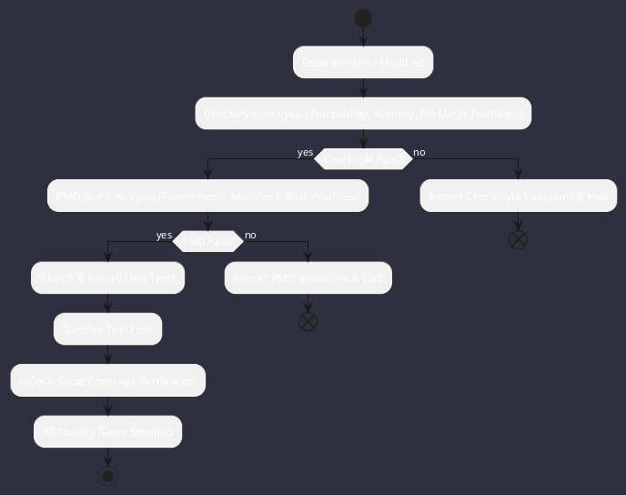

# Quality Assurance Index

Omniwrench enforces continuous quality gatekeeping through automated static analysis, architectural linting, and coverage verifiers.

## Quality Pillars
1. **Traceability Verification**: Every class and method contains traceability annotations (`CS-0010`).
2. **Defensive Preconditions**: Zero unvalidated parameters upon entry (`CS-0030.1`).
3. **No Local `var`**: Explicit typing required across all variables (`CS-0030.10`).
4. **Symbolic Limitations**: Zero magic numbers (`CS-0040.1`).
