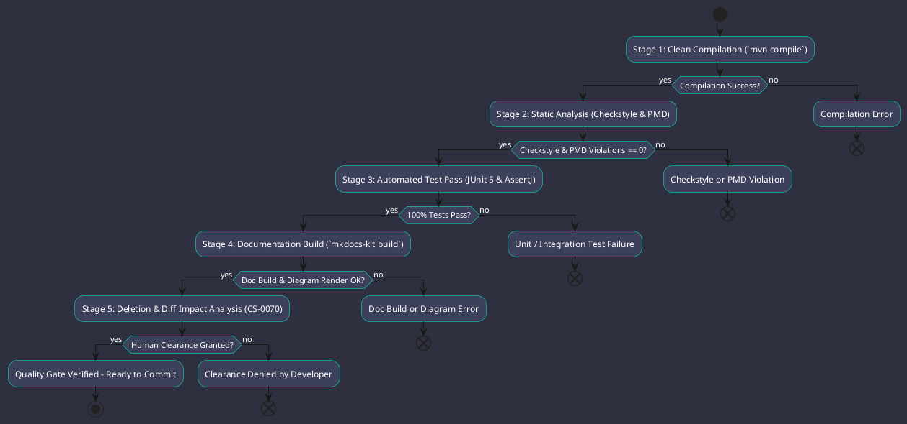

# Quality Assurance & 5-Stage Verification Gate

Omniwrench enforces continuous quality gatekeeping through a strict **5-Stage Verification Protocol** (ADR-0028) integrating compilation, static analysis, test execution, documentation build, and deletion impact verification.

## Quality Pillars & Enforced Standards
1. **Stage 1: Clean Compilation**: Java 21 compilation with `-parameters` and zero warnings.
2. **Stage 2: Static Analysis**: Checkstyle (`checkstyle.xml`) and PMD (`pmd-ruleset.xml`) enforcement.
3. **Stage 3: Automated Test Pass**: 100% test execution pass rate across all modules (`mvn test`).
4. **Stage 4: Documentation Verification**: Full `mkdocs-kit` HTML/PDF compilation with zero broken links.
5. **Stage 5: Deletion & Impact Analysis**: Strict human clearance guardrails per `CS-0070`.

