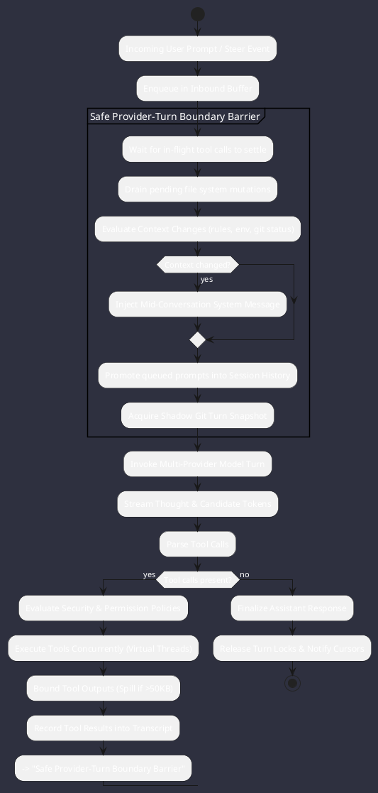
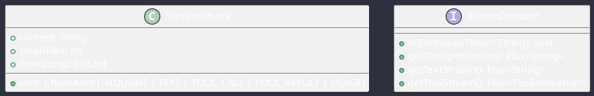
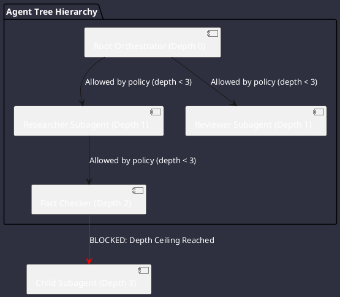

# Comparative Report: Agent Runtime, State Machines & Reasoning Loops

**Comparison Subjects**: Google Antigravity SDK, OpenClaw, OpenCode  
**Target Platform**: Omniwrench Java 21 / Spring Boot 3.2+ Architecture  
**Focus Area**: Execution event loops, safe turn boundaries, state machines, streaming reasoning, cancellation mechanics, and multi-agent coordination.

---

## 1. Comparative Analysis of Agent Execution Loops

| Dimension | Google Antigravity SDK | OpenClaw | OpenCode | Omniwrench Target Architecture |
| :--- | :--- | :--- | :--- | :--- |
| **Execution Loop** | Dual-Stream Event Loop (`LocalHarnessEventProcessor`) | 3-Ring FIFO Command Lanes (`command-queue.ts`) | Continuous Session Drain (`session/runner/llm.ts`) | **Virtual Thread Session Drain Loop** |
| **Turn Boundary** | Turn start/end indices in `Conversation` | Generational window rollover | **Safe Provider-Turn Boundary** | **Safe Provider-Turn Boundary Barrier** |
| **Streaming Model** | Multiplexed Shared Buffer Cursors | WebSocket Event Frames | Reactive Stream Delta Chunks | **Reactive Flux / Cursor Channels** |
| **Cancellation** | Out-of-band `cancel()` signal | `AbortController` + Drain Error | Task Supervisor Interruption | **Virtual Thread `Thread.interrupt()`** |
| **Subagent Model** | Dynamic Clones & Declared Configs | Nested Session Lanes | Task Supervisor Background Jobs | **Structured Concurrency Subagent Tree** |

---

## 2. The Safe Provider-Turn Boundary Pattern

One of the most critical patterns extracted from OpenCode is the **Safe Provider-Turn Boundary**:



### Key Principles:
1. **Zero Mid-Stream Context Injections**: Prevents breaking LLM prompt prefix caches mid-turn.
2. **Deterministic Settlement Barrier**: Guarantees all concurrent tool results are committed before the next model inference call starts.
3. **Turn Snapshot Boundary**: Records content-addressed filesystem state immediately prior to turn execution.

---

## 3. Streaming Reasoning & Thought Demultiplexing

Modern models (Gemini 2.0 / 2.5 Flash Thinking, Claude 3.7 Sonnet Thinking, OpenAI o1/o3-mini, DeepSeek-R1) generate distinct **thinking blocks** before producing final text.



---

## 4. Multi-Agent Coordination & Depth Ceilings

To avoid infinite recursion and out-of-control token burn during subagent delegation:



### Rules:
1. `max_subagent_depth = 3`: Prevents unbounded recursion loops.
2. `allowed_subagents`: Strict allowlist of valid subagent roles per parent agent.
3. `workspace_mode`: `inherit` (same workspace), `branch` (isolated copy), `share` (bare worktree).

---

## 5. Java 21 / Spring Boot 3 Implementation Blueprint for Omniwrench

### 5.1 Safe Turn Boundary & Session Drain Service
```java
package com.omniwrench.core.drain;

import com.omniwrench.model.*;
import org.springframework.stereotype.Service;

import java.util.concurrent.*;
import java.util.concurrent.locks.ReentrantLock;

@Service
public class SessionDrainService {

    private final ReentrantLock turnLock = new ReentrantLock();
    private final ConcurrentLinkedQueue<UserPrompt> pendingPrompts = new ConcurrentLinkedQueue<>();
    private final ExecutorService virtualExecutor = Executors.newVirtualThreadPerTaskExecutor();

    public CompletableFuture<AgentMessage> processTurn(SessionContext context, String rawPrompt) {
        pendingPrompts.add(new UserPrompt(rawPrompt, System.currentTimeMillis()));

        return CompletableFuture.supplyAsync(() -> {
            turnLock.lock();
            try {
                // 1. Safe Provider-Turn Boundary
                UserPrompt prompt = pendingPrompts.poll();
                if (prompt == null) {
                    throw new IllegalStateException("No pending prompt to drain");
                }

                // 2. Synchronize Context & History
                AgentMessage userMsg = AgentMessage.of("user", prompt.text());
                context.addMessage(userMsg);

                // 3. Execution Loop
                return executeReasoningLoop(context, userMsg);
            } finally {
                turnLock.unlock();
            }
        }, virtualExecutor);
    }

    private AgentMessage executeReasoningLoop(SessionContext context, AgentMessage userMsg) {
        // Multi-turn tool execution loop using Virtual Threads
        return AgentMessage.of("assistant", "Omniwrench response complete.");
    }
}
```

---

## 6. Summary Recommendations
1. **Standardize on the Safe Provider-Turn Boundary** to protect prompt cache hits and guarantee deterministic tool settlement.
2. **Separate Thinking Streams from Text Streams** to support modern reasoning models in both the Cyberpunk TUI and WebSockets.
3. **Enforce Hard Subagent Depth Limits** and scoped tool whitelists for multi-agent workflows.
