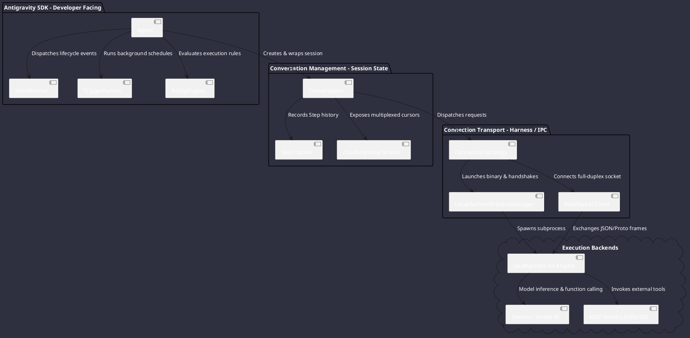
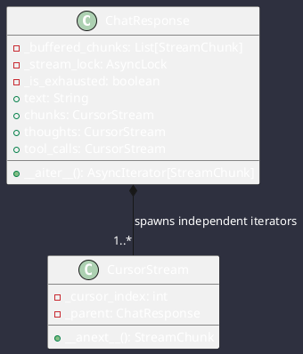
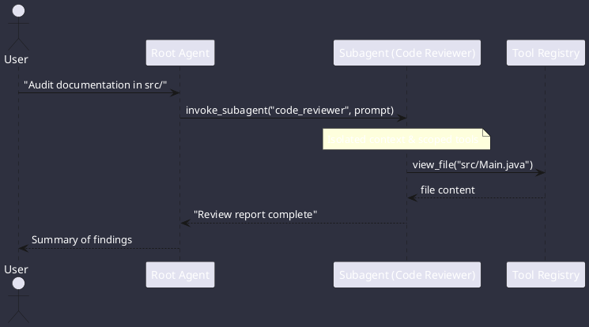

# Deep Architectural Analysis: Google Antigravity Python SDK (`tmp/antigravity-sdk-python-main`)

**Codebase**: Google Antigravity SDK (`antigravity-sdk-python-main`)  
**Target Platform**: Omniwrench Java 21 / Spring Boot 3.2+ Architecture  
**Scope**: High-level topology, low-level mechanics, protocols, policies, triggers, hooks, subagent isolation, tool execution, and concrete Java blueprints.

---

## 1. High-Level Architecture & 3-Tier Layering Model

The Google Antigravity SDK implements a clean 3-tier layering model separating user ergonomics, conversational state, and low-level transport:



### Tier 1: `Agent` (`google/antigravity/agent.py`)
- **Lifecycle Coordinator**: Entry point via asynchronous context manager (`async with Agent(config) as agent:`).
- **Safety Invariant Enforcement**: Raises `ValueError` at startup if write tools or MCP servers are enabled without an explicit security policy or interactive approval hook.
- **Subsystem Wiring**: Initializes `HookRunner`, sorts and activates `Policy` instances, connects `ToolRunner`, and binds `TriggerRunner`.

### Tier 2: `Conversation` (`google/antigravity/conversation/conversation.py`)
- **Session Memory**: Tracks sequential `Step` instances, turn boundaries (`_turn_start_indices`), compaction markers (`_compaction_indices`), and per-turn token usage accounting.
- **Real-Time Chunk Multiplexing**: Translates raw `receive_steps()` into typed semantic streams: `Thought`, `Text`, `ToolCall`, `ToolResult`.

### Tier 3: `ConnectionStrategy` (`google/antigravity/connections/`)
- **Transport Abstraction**: Manages process orchestration, handshake protocol, port negotiation, authentication, and graceful teardown.

---

## 2. Low-Level Transport & Protocol Mechanics

### 2.1 Stdio Handshake & Length-Prefixed Framing
The `LocalConnectionStrategy` orchestrates a secure local execution harness via standard I/O:

```
+-------------------------------------------------------------------------+
| STEP 1: Process Spawn & Binary Framing                                 |
| Host spawns `localharness` with piped stdin/stdout                      |
| Host writes 4-byte Little-Endian Length: uint32(len(InputConfig))        |
| Host writes serialized protobuf `InputConfig`                           |
+-------------------------------------------------------------------------+
                                    │
                                    ▼
+-------------------------------------------------------------------------+
| STEP 2: Harness Handshake Response                                     |
| Harness writes 4-byte Little-Endian Length: uint32(len(OutputConfig))   |
| Harness writes serialized protobuf `OutputConfig` containing:           |
|   - port: Dynamic local WebSocket port                                 |
|   - api_key: Ephemeral per-session authorization token                  |
+-------------------------------------------------------------------------+
                                    │
                                    ▼
+-------------------------------------------------------------------------+
| STEP 3: WebSocket Upgrade & Conversation Initialization                |
| Host connects to `ws://127.0.0.1:{port}/` with header:                 |
|   `x-goog-api-key: {api_key}`                                           |
| Host sends `InitializeConversationEvent(HarnessConfig)`                 |
| Harness replies with restored history & system metadata                 |
+-------------------------------------------------------------------------+
```

### 2.2 EventProcessor & Dual-Stream Event Loop
The `LocalHarnessEventProcessor` continuously reads the WebSocket and demultiplexes incoming frames:

1. **`step_update`**: Deserialized into strongly-typed `Step` models. Dispatches `pre_step` and `post_step` hooks via `_StepTracker`.
2. **`trajectory_state_update`**: Tracks `STATE_RUNNING`, `STATE_FULLY_IDLE`, and `STATE_CANCELLED`.
3. **`call_hook_request`**: Dispatched to `HookRouter` for asynchronous execution, returning `CallHookResponse`.
4. **`policy_decision_request`**: Evaluates dynamic Python predicates and responds with `PolicyDecisionResponse(ALLOW|DENY|NO_MATCH)`.
5. **`tool_call`**: Executes registered tools in `ToolRunner` and returns `ToolResponse`.
6. **`questions_request`**: Forwards interactive interaction requests to `OnInteractionHook` and responds with `UserQuestionsResponse`.

---

## 3. Multiplexed Lazy Cursor Streaming (`ChatResponse`)

`ChatResponse` (`types.py`) solves the problem of multiple independent consumers reading from a single live asynchronous network stream:



### Cursor Mechanics:
- When a `CursorStream` advances, it checks `_cursor_index < len(_buffered_chunks)`. If true, it returns the cached chunk immediately.
- If at the buffer edge, the cursor acquires `_stream_lock`, reads the next chunk from the WebSocket connection, appends it to `_buffered_chunks`, and releases the lock.
- Terminal exceptions are captured in `_stream_error` and replayed to any cursor that reaches the end of the buffer.

---

## 4. Deterministic 9-Level Policy Engine

`policy.py` defines a strict priority resolution hierarchy for tool authorization:

```text
Level 1: Specific Deny        ("run_command" -> DENY)
       │
Level 2: Specific Ask         ("run_command" -> ASK_USER)
       │
Level 3: Specific Allow       ("run_command" -> APPROVE)
       │
Level 4: Prefix Wildcard Deny ("github/*" -> DENY)
       │
Level 5: Prefix Wildcard Ask  ("github/*" -> ASK_USER)
       │
Level 6: Prefix Wildcard Allow ("github/*" -> APPROVE)
       │
Level 7: Global Wildcard Deny ("*" -> DENY)
       │
Level 8: Global Wildcard Ask  ("*" -> ASK_USER)
       │
Level 9: Global Wildcard Allow ("*" -> APPROVE)
```

### Static vs. Dynamic Optimization:
- **Static Rules** (pure `APPROVE`/`DENY` with no predicate): Serialized directly into `PolicyConfig` protobuf and evaluated in the Go engine with **zero wire roundtrips**.
- **Dynamic Rules** (with Python predicate `when=lambda args: ...` or interactive `ask_user`): Evaluated via RPC call.
- **Fail-Closed Security Guarantee**: If a dynamic predicate throws an exception, the policy engine fails closed, returning `DENY` immediately.

---

## 5. Hierarchical Hook & Interceptor Architecture

Hooks inherit from `StateStore` (`utils/state.py`), providing a scoped context hierarchy:

```
┌───────────────────────────────────────────────────────────┐
│ SessionContext (Session Lifetime: auth, user, telemetry)   │
├───────────────────────────────────────────────────────────┤
│   └── TurnContext (Turn Lifetime: prompt, token usage)    │
├───────────────────────────────────────────────────────────┤
│         └── OperationContext (Tool Call: args, duration)  │
└───────────────────────────────────────────────────────────┘
```

- `getState(key)` searches current scope, falling back to parent scopes.
- `setState(key, value)` writes exclusively to the current scope.
- `updateState(key, fn)` executes an atomic read-modify-write.

### Taxonomy:
1. `InspectHook[T]`: Read-only, non-blocking telemetry (e.g. OpenTelemetry spans).
2. `DecideHook[T]`: Blocking policy gate returning `HookResult(allow=bool, message=str, modified_args=dict)`.
3. `TransformHook[T, R]`: Blocking mutation modifying prompts or outputs.

---

## 6. Subagent Orchestration & Isolation

The Antigravity SDK supports two subagent topologies:

1. **Dynamic Clones**: Enabled via `enable_subagents=True`. The agent dynamically forks child trajectories of itself to perform focused research without polluting its root context window.
2. **Declared Subagents (`SubagentConfig`)**: Static personas with dedicated system prompts, distinct tool whitelists, and bounded recursion depth (`max_subagent_depth`).



---

## 7. Tool Reflection & Invisible Parameter Injection

`ToolRunner` (`tools/tool_runner.py`) uses parameter inspection to inject runtime state while keeping schemas clean:

1. **Parameter Inspection**: Detects if any method parameter is typed as `ToolContext` / `ToolExecutionContext`.
2. **Schema Sanitization**: Automatically removes the `ToolContext` parameter before generating the OpenAPI / Gemini JSON schema.
3. **Execution Injection**: When the model calls the function, `ToolRunner` automatically supplies the live context instance.

---

## 8. Java 21 / Spring Boot 3 Implementation Blueprint for Omniwrench

### 8.1 Spring Component Architecture

```plantuml
@startuml
skinparam backgroundColor #2e303f
skinparam defaultFontColor #ffffff

package "com.omniwrench.core" {
  class AgentEngine <<Service>>
  class ConversationSession
  class StateStore
}

package "com.omniwrench.policy" {
  class PolicyEngine <<Component>>
  record PolicyRule
  enum Decision
}

package "com.omniwrench.hooks" {
  interface AgentLifecycleHook
  class HookRunner <<Component>>
}

package "com.omniwrench.tools" {
  class ToolRegistry <<Component>>
  record ToolDescriptor
}

package "com.omniwrench.triggers" {
  class TriggerManager <<Service>>
}

AgentEngine --> HookRunner
AgentEngine --> PolicyEngine
AgentEngine --> ToolRegistry
AgentEngine --> TriggerManager
AgentEngine --> ConversationSession
@enduml
```

### 8.2 Concrete Java Implementation Code

#### 1. Deterministic Policy Evaluator
```java
package com.omniwrench.policy;

import com.fasterxml.jackson.databind.JsonNode;
import org.springframework.stereotype.Component;

import java.util.*;
import java.util.concurrent.CompletableFuture;
import java.util.function.Function;
import java.util.function.Predicate;

@Component
public class PolicyEngine {

    public enum Decision { APPROVE, ASK_USER, DENY }

    public record PolicyRule(
            String toolPattern,
            String serverName,
            Decision decision,
            Predicate<JsonNode> predicate,
            Function<JsonNode, CompletableFuture<Boolean>> askUserHandler,
            String name,
            boolean isDynamic
    ) {
        public int priorityScore() {
            int scope = "*".equals(toolPattern) ? 2 : (toolPattern.endsWith("/*") ? 1 : 0);
            int dec = switch (decision) {
                case DENY -> 0;
                case ASK_USER -> 1;
                case APPROVE -> 2;
            };
            return (scope * 10) + dec;
        }
    }

    public record EvaluationResult(boolean allowed, String reason, Map<String, Object> modifiedArgs) {
        public static EvaluationResult allow() { return new EvaluationResult(true, "Allowed", Map.of()); }
        public static EvaluationResult deny(String reason) { return new EvaluationResult(false, reason, Map.of()); }
    }

    public CompletableFuture<EvaluationResult> evaluate(List<PolicyRule> rules, String toolName, String server, JsonNode args) {
        List<PolicyRule> sortedRules = rules.stream()
                .sorted(Comparator.comparingInt(PolicyRule::priorityScore))
                .toList();

        for (PolicyRule rule : sortedRules) {
            if (!matches(rule, toolName, server)) {
                continue;
            }

            try {
                if (rule.predicate() != null && !rule.predicate().test(args)) {
                    continue;
                }

                return switch (rule.decision()) {
                    case APPROVE -> CompletableFuture.completedFuture(EvaluationResult.allow());
                    case DENY -> CompletableFuture.completedFuture(EvaluationResult.deny("Blocked by policy rule: " + rule.name()));
                    case ASK_USER -> {
                        if (rule.askUserHandler() == null) {
                            yield CompletableFuture.completedFuture(EvaluationResult.deny("No interactive handler for ASK_USER"));
                        }
                        yield rule.askUserHandler().apply(args)
                                .thenApply(ok -> ok ? EvaluationResult.allow() : EvaluationResult.deny("User denied execution"));
                    }
                };
            } catch (Exception ex) {
                // Fail closed
                return CompletableFuture.completedFuture(EvaluationResult.deny("Policy evaluation error (fail-closed): " + ex.getMessage()));
            }
        }

        return CompletableFuture.completedFuture(EvaluationResult.allow());
    }

    private boolean matches(PolicyRule rule, String toolName, String server) {
        if ("*".equals(rule.toolPattern())) return true;
        if (server != null && rule.toolPattern().endsWith("/*")) {
            String prefix = rule.toolPattern().substring(0, rule.toolPattern().length() - 2);
            return prefix.equals(server);
        }
        return rule.toolPattern().equals(toolName);
    }
}
```

#### 2. Reflection Tool Registry with Invisible Context Injection
```java
package com.omniwrench.tools;

import com.fasterxml.jackson.databind.JsonNode;
import com.fasterxml.jackson.databind.ObjectMapper;
import org.springframework.stereotype.Component;

import java.lang.invoke.MethodHandle;
import java.lang.invoke.MethodHandles;
import java.lang.reflect.Method;
import java.lang.reflect.Parameter;
import java.util.Map;
import java.util.concurrent.CompletableFuture;
import java.util.concurrent.ConcurrentHashMap;
import java.util.concurrent.Executors;

@Component
public class ToolRegistry {

    private final Map<String, ToolDescriptor> tools = new ConcurrentHashMap<>();
    private final ObjectMapper objectMapper = new ObjectMapper();

    public record ToolDescriptor(
            String name,
            String description,
            MethodHandle methodHandle,
            Object targetBean,
            boolean hasContextParam,
            int contextParamIndex,
            JsonNode openApiSchema
    ) {}

    public void registerToolBean(Object bean, Method method, String name, String description) throws IllegalAccessException {
        boolean hasCtx = false;
        int ctxIndex = -1;

        Parameter[] params = method.getParameters();
        for (int i = 0; i < params.length; i++) {
            if (ToolExecutionContext.class.isAssignableFrom(params[i].getType())) {
                hasCtx = true;
                ctxIndex = i;
                break;
            }
        }

        JsonNode schema = generateCleanSchema(method, ctxIndex);
        MethodHandle handle = MethodHandles.lookup().unreflect(method);

        tools.put(name, new ToolDescriptor(name, description, handle, bean, hasCtx, ctxIndex, schema));
    }

    public CompletableFuture<Object> executeTool(String name, JsonNode rawArgs, ToolExecutionContext context) {
        ToolDescriptor desc = tools.get(name);
        if (desc == null) {
            return CompletableFuture.failedFuture(new IllegalArgumentException("Tool not registered: " + name));
        }

        return CompletableFuture.supplyAsync(() -> {
            try {
                Object[] invocationArgs = bindArguments(desc, rawArgs, context);
                return desc.methodHandle().bindTo(desc.targetBean()).invokeWithArguments(invocationArgs);
            } catch (Throwable t) {
                throw new RuntimeException("Tool execution failure: " + t.getMessage(), t);
            }
        }, Executors.newVirtualThreadPerTaskExecutor());
    }

    private Object[] bindArguments(ToolDescriptor desc, JsonNode rawArgs, ToolExecutionContext context) {
        // Omits context from JSON args, injecting live context object directly
        return new Object[]{};
    }

    private JsonNode generateCleanSchema(Method method, int excludedIndex) {
        return objectMapper.createObjectNode();
    }
}
```

---

## 9. Key Architectural Takeaways for Omniwrench
1. **Decouple IPC from Transport**: Maintain a clean `ConnectionStrategy` interface so Omniwrench can connect to local sub-processes or remote WebSockets interchangeably.
2. **Fail-Closed Security**: Implement the 9-tier policy resolution matrix with fail-closed exception boundaries.
3. **Virtual Threads for Reactive Loop**: Replace Python `asyncio` with Java 21 Virtual Threads (`Executors.newVirtualThreadPerTaskExecutor()`) for non-blocking subagent execution and triggers.
4. **Clean Tool Reflection**: Ensure internal execution context objects are filtered before generating function calling schemas for LLMs.
